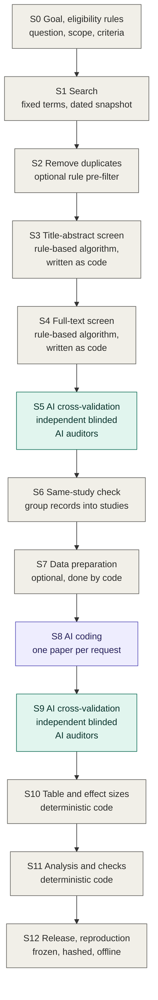
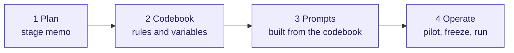

# RAES Protocol

Version 0.4, draft. 2026-09-23. Distributed with RAES 0.5.0. The protocol and the software are numbered separately: this number changes when the text of the method changes, the software's when the templates, scripts or skill change.

[English](PROTOCOL.md) | [简体中文](PROTOCOL.zh-CN.md)

This document describes how I run an AI-assisted evidence synthesis so that another researcher can check every step. The [README](README.md) gives the short version. This is the working manual. It is written from one completed project, a social-science meta-analysis, and I note where a choice was specific to that project.

It is organized the way I would explain the workflow in person. Section 1 shows the whole pipeline in one figure. Sections 2 to 4 say who does what, what the workflow builds on, and which principles hold throughout. Section 5 gives the order I follow whenever a step calls an AI. Section 6 then expands every stage of the figure in the same format.

## 1. The pipeline at a glance



Grey boxes are done by the researcher or by deterministic code. The purple box is executed by an AI under the codebook. Green boxes are audits by independent AIs.

The first half follows the PRISMA 2020 flow (Page et al., 2021): identification, screening, included studies. PRISMA's flow diagram ends there. The later stages apply the same discipline to coding, effect sizes, analysis and release.

| Stage | Done by | What it produces | PRISMA 2020 phase |
|---|---|---|---|
| S0 Goal and eligibility rules | Researcher | Research question, numbered eligibility criteria, outcome map | Before the search |
| S1 Search | Researcher | Fixed search terms, dated search snapshot with queries and counts | Identification |
| S2 Remove duplicates | Researcher, in a reference manager | Deduplicated library exported as a text file, counts before and after, optional rule-based pre-filter | Identification |
| S3 Title and abstract screening | Code | Decision and reason for every record | Screening |
| S4 Full-text screening | Code | Criterion-by-criterion evidence and a decision for every retrieved paper | Screening |
| S5 AI cross-validation of screening | AI auditors | Audited samples of exclusions, confirmed misses, and the rule revisions they cause | Screening |
| S6 Same-study check | Code | Groups of records that report the same study, one representative each | Included |
| S7 Data preparation (optional) | Code, optionally with AI assistance | Per-paper data summary, matched comparison data, tracker | |
| S8 AI coding | AI executor | Per-paper coded rows in a fixed column template | |
| S9 AI cross-validation of coding | AI auditors | Audit result for every row that feeds the analysis | |
| S10 Master table and effect sizes | Code | One table with stable row identifiers and computed effects | |
| S11 Analysis and statistical validation | Code | Results, robustness checks, independent numerical checks | |
| S12 Release and reproduction | Code | Immutable releases, pointers, one-command offline rebuild | |

Two things run through the whole figure. The goal and the eligibility rules are fixed first (S0), because every later stage refers to them. And every step that calls an AI is prepared in the same order: plan, codebook, prompts, operate. Section 5 describes that order.

## 2. Scope and roles

RAES covers projects that screen a literature against written criteria and then code information from the included studies: meta-analyses, systematic reviews, and literature databases built for later analysis. It does not tell you how to design a search strategy or which statistical model to use. It tells you how to run those steps so that they can be audited and reproduced.

There are four roles.

- **The researcher** writes the rules, makes a small number of bounded adjudications, and is responsible for the result. In my project that is me, so wherever this document says "I", it is the researcher speaking.
- **The executor** is the model that applies the rules, for example when coding a paper.
- **The auditors** are independent models that check the work blind. Where possible they come from vendors other than the executor's.
- **Deterministic code** does everything that can be computed: rule-based screening where feasible, validation of model output, table assembly, effect sizes and statistics.

The rule of thumb I use: if a step can be written as code, it is code. If it needs reading comprehension, the executor does it under a written rule. If it needs a judgment that no rule covers, I stop and write the rule first.

## 3. What RAES builds on

**PRISMA 2020** (Page et al., 2021). Stages S1 to S6 follow its flow from identification to included studies, use its distinction between records, reports and studies, and produce the counts its flow diagram asks for.

**Rule-based screening** (Robleto and Shehadeh, 2025). Their protocol screens with transparent Python rules in two phases, first on titles and abstracts and then on full texts. S3 and S4 are rule-based in the same way. Their paper validates the rules by testing them on known relevant papers and by reading a random sample of excluded records, and it names a more rigorous, quantitative validation as the next step. S5 is my attempt at that step: frozen rules and sampling frame, strata that concentrate on near misses, blinded auditors from different vendors, a stopping rule written in advance, and a confirmed miss that leads to a revised rule, not to a correction by hand.

**Guidance on AI in evidence synthesis.** The RAISE recommendations (Thomas et al., 2025) and the joint position statement of Cochrane, the Campbell Collaboration, JBI and the Collaboration for Environmental Evidence (Flemyng et al., 2025) expect human oversight, transparency and validation of AI output. They state what is expected. RAES is one concrete way of doing it.

What comes after screening is my own addition and came out of my project: the same-study check, AI coding under a codebook, cross-validation of the coded rows, effect sizes computed only by code, and immutable releases that can be rebuilt offline.

## 4. Principles

**1. Codebook first.** Every substantive judgment goes into a versioned codebook before any formal run. Prompts are generated from the codebook. When a run exposes an ambiguity, I fix the rule and bump the version. I do not patch the output by hand.

**2. The AI executes rules; it does not set scope.** The executor may not rewrite, relax or replace a criterion. When the evidence is missing or ambiguous it returns `null` and records an unresolved item. It never fills a gap with a plausible value.

**3. The unit of judgment is the condition, not the paper.** Papers in experimental fields contain many arms, roles and outcomes. Eligibility and coding are decided for each one. A paper can be included while most of its conditions are not.

**4. Deterministic wherever possible.** Effect sizes, standard errors and confidence intervals are computed by code from coded inputs. The executor only selects the computation path. The same holds for table assembly, identifiers and every statistic in the analysis.

**5. Independent audit, with limits on what each auditor sees.** A screening auditor sees the paper and the rules. It does not see the earlier decision or the reason for it. A coding auditor must see the coded values, because those are what it checks. It does not see the executor's reasoning or any result computed later. In the full-text audit, two auditors work independently and a third is called only when they disagree. In the coding audit, one auditor checks every paper, and a second auditor is called only when a value is challenged. The second auditor does not see what the first one proposed. Human adjudication is limited to defined cases and must cite the page.

**6. A technical failure is not a decision.** Refusals, malformed output, schema failures and timeouts are retried under an unchanged request. They never count as an exclusion, a pass or a vote.

**7. Sampling and stopping rules are fixed in advance.** The sampling frame, strata, random seed and stopping conditions of each validation are written down before the first request is sent.

**8. Everything that enters a formal run is frozen and hashed.** Rules, prompts, configuration, code and input files are recorded with hashes before the run. If one of them changes in a way that could change a decision, the run stops. The change gets a new version and a note on what it affects. The affected items are validated again. Results that are not affected can be kept, but only after checking that their inputs, identities and rules are exactly the same. They keep their original version and date.

**9. Releases are immutable; pointers move.** A finished stage is saved as a dated release that is never edited. A small `CURRENT` file points to the active release. Superseded material is archived with a manifest, not deleted.

**10. Offline reproducibility.** Every model response is saved. One command rebuilds all results from those saved responses, with the internet switched off. It does not search the databases again and it does not ask the models again. Collecting new responses is a separate step that needs explicit approval.

**11. Cached attributes keep entities consistent across studies.** When the same entity appears in many studies, its coded attributes are looked up in a cache before anything is scored again. The cache is a versioned rule file like any other: an attribute that changes gets a new version, and the rows it affects are rerun. In my project the entities are AI models, and the attributes are measures such as model strength and openness.

**12. Say what each validation shows and what it does not.** A clean audit of sampled exclusions supports the screening rule for that snapshot of the search. It is not proof that no eligible study was missed.

## 5. The order I follow at every step that calls an AI



In my project three stages call an AI: the cross-validation of screening (S5), the coding (S8) and the cross-validation of coding (S9). If your screening criteria cannot be written as code, S3 and S4 would call one too. Each time I prepare the step in the same order, and nothing is sent to a provider until the first three items exist in writing.

### 5.1 Plan

A short memo for the stage. It fixes the question the step answers, the unit of judgment, what the model will see and what it must not see, the output it must return, which models play which role, the frame or the sample, the rules for retries and for stopping, the expected cost, and what counts as done. For a small step this is one page. For the screening audit in my project it grew into a full pre-specified protocol.

I let a model draft the plan memo and the first codebook from my description of the project. I then read every line, because the coding, its audit and the analysis are all built on it.

### 5.2 Codebook

The codebook is a JSON file. For every variable it gives the name, a description, the allowed values, an example and notes. The notes carry most of the value:

- a core rule that can be checked;
- how to convert source-specific measures into the canonical scale;
- boundary cases and counterexamples;
- a list of things not to do;
- how to document the source of each number.

Beyond the variable table, my coding codebook contains the eligibility criteria with operational clarifications, the hierarchy for choosing comparison data, rules for aggregating across opponents or sampling settings, a statement of which fields the model fills and which fields code computes, the cache-first rule for entity attributes, and a version string. In the templates of this repository the criteria stay in one file, `codebook/eligibility.json`; the codebook records that file's SHA-256, and the prompt renderer inserts the text from the file, so that the criteria are never copied by hand.

A generic example of one entry:

```json
{
  "name": "Outcome_Metric",
  "description": "Canonical outcome label used for the effect size.",
  "allowed_values": ["rate", "share"],
  "example": "share",
  "notes": {
    "core_rule": "Use exactly one label from allowed_values. Higher values must mean more of the target construct.",
    "scale_rule": "Convert amounts to 0-1 shares with a stated denominator. If the denominator is not explicit, leave the numeric inputs null and record the raw statistic.",
    "do_not_use": ["source-specific variable names", "labels that contain 'or'"]
  }
}
```

An audit step has its own, smaller codebook. The validation codebook quotes the eligibility criteria or the coding rules verbatim, inserted from the eligibility file rather than retyped, tells auditors what to decide, and fixes the exact fields they must return.

### 5.3 Prompts

Prompts are built from the codebook and contain no rule that is not in it.

For coding, the system prompt states the role, says that the codebook and template are the only source of truth, forbids invented values, reserves the deterministic fields for code, and lists the self-check. The paper prompt supplies the metadata, the inputs, the eligibility criteria verbatim, the task, the distinction between creating a row and being able to compute an effect, the required notes, the output structure, and guidance on how many rows to expect.

For an audit, the prompt gives the auditor the source material and the rules and nothing else. What it must not contain is listed in Section 7.

### 5.4 Operate

*Pilot.* Run a few items. Read the unresolved items, warnings and skipped conditions before reading the rows. When the executor did something I did not intend, the question is which rule allowed it.

*Clarify and version.* Clarifications should be minimal and general: they state how the existing criterion applies to a recurring pattern, and they do not decide individual papers. Every clarification changes the version string, and I record which papers must be rerun because of it.

*Freeze.* Before the formal run, the rules, prompts, configuration, code and inputs are recorded with hashes.

*Run.* The workflow configuration is a separate file that fixes the operational side: the models and their settings, how files are delivered, how disagreement is routed, the sampling design and seed, the retry policy, and a confirmation token without which no live request is sent. Runners validate everything offline by default and need an explicit flag to contact a provider. They never overwrite earlier output, they save every raw response, and they can resume after an interruption without resubmitting finished items.

### 5.5 Order across the whole project

Goal and eligibility criteria, plan memo, coding codebook, column template, prompts, a small pilot, a log of ambiguities, minimal clarifications with a new version, freeze, then the validation codebooks and workflow configurations, and finally an implementation-ready memo that a collaborator could execute without asking me questions.

## 6. The stages, one by one

Each stage has the same four parts: who does it, what goes in and what comes out, what I do, and what I check before moving on. Stages that call an AI describe what I do in the order of Section 5.

### S0 Goal and eligibility rules

**Done by:** the researcher.
**In:** the research idea. **Out:** a short statement of the question and scope, numbered eligibility criteria, and a map from each study design to the outcome that will be coded.

**What I do.** This comes before any search. I write down what is being studied and for what purpose, then the eligibility rules, then the outcome map. I number the criteria, because every later stage refers to them by number. My project has five: the type of task, who makes the decision, the kind of outcome, how the outcome is measured, and the absence of instructions that steer behavior. Each criterion gets operational clarifications as the project goes on: concrete failing cases, cases that look like failures but are not, and a rule for papers that contain both eligible and ineligible conditions.

**Before moving on.** I check two things. First, every criterion can be answered by reading the paper: I can point to the passage that shows whether it is met. A criterion that depends on something papers do not report cannot be screened or audited. Second, the criteria have a version number. The screening rules, the audit codebooks and the coding codebook all copy the criteria word for word, so when a criterion changes, the version tells me which files must be updated and which runs used the old wording.

### S1 Search

**Done by:** the researcher.
**In:** the question and the eligibility criteria from S0. **Out:** the fixed search terms, and a dated search snapshot: databases, exact query strings, date range, records per source, and the raw exports.

**What I do.** I fix the search terms before the first search and write them down. The same terms are used in every database, adapted only to each database's syntax, and in every later update of the search, where only the date range changes. My project searches three databases: Web of Science, EBSCOhost and arXiv.

For each search I record the databases, the exact query strings, the date range and the number of records from each source. Most databases export their results directly. A source without an export function needs a small script. I use one for arXiv, and it saves the results in a format the reference manager can import. Give each cumulative search a snapshot identifier such as `search_through_2026-04-30`. An update to the search is a new snapshot, and it restarts the audit history of S5.

**Before moving on.** The search terms are identical across databases and across updates. The raw exports are saved unchanged, and the counts per source can be regenerated from them.

### S2 Remove duplicates

**Done by:** the researcher, in a reference manager. I use EndNote.
**In:** the raw exports from every source. **Out:** one deduplicated library, exported as a text file that the screening program reads, and the record counts before and after.

**What I do.** I import the search results from every source into EndNote, remove the duplicates there, and export the library as a text file. The screening program in S3 parses that file. I write down how many records came in and how many duplicates were removed, because the PRISMA flow diagram reports both.

An optional step can follow: a one-line rule that removes records which plainly fail an eligibility rule on a field that needs no reading, such as document type. For example, if the synthesis needs studies that report data, records whose title marks them as a review can be removed here. In the PRISMA 2020 flow diagram these removals are reported under "records removed before screening", which has one line for duplicates and one for records marked as ineligible by automation tools.

A reader without a reference manager can use the deduplication script that ships with the skill. It produces the same things from the raw exports: the table of records, a ledger with the reason for every removal, the pairs it is not sure about for the researcher to decide, and the counts.

The exported text file is the source from here on, and spreadsheets are only for viewing. A spreadsheet silently truncated one long abstract in my project, and the preflight check of S3 now requires exact equality between the screened text and the parsed source.

**Before moving on.** Records identified equals records removed plus records passed to screening. A pre-filter rule is kept only if I would defend every single removal it makes. Anything less clear is left to S3, where it receives a reason and can be audited.

### S3 Title and abstract screening

**Done by:** deterministic code, a rule-based algorithm.
**In:** the text file exported in S2. **Out:** a decision and a reason for every record.

**What I do.** The screen is rule-based, as in Robleto and Shehadeh (2025). I define the screening rules from the eligibility criteria, and they are written as a Python program. The program parses the exported text file into records and screens the title and abstract of each one. My own program parses EndNote's export directly. The program in this repository's templates reads a three-column table made from that export, with a record identifier, the title and the abstract, so that it does not depend on one reference manager's format. The goal at this stage is high recall. Because the screen is a program, the same record always receives the same decision, and the rule can be versioned like code. If your criteria cannot be expressed that way, the executor can screen under a codebook, prepared in the order of Section 5. The audit in S5 is the same in both cases.

**Before moving on.** Every record has a decision and a reason. The preflight check confirms that the screened text is exactly the parsed source text.

### S4 Full-text screening

**Done by:** deterministic code.
**In:** the full texts of the records that passed S3. **Out:** criterion-by-criterion evidence and a decision for every retrieved paper.

**What I do.** This is the second phase of the same rule-based design. The program reads the text extracted from each PDF, by one extraction tool for the whole project with its version recorded, retrieves the passages relevant to each criterion, and records for every criterion whether it is supported, together with the evidence. The decision follows from the criteria.

**Before moving on.** Keep the criterion-level record, because S5 uses it to find near misses. Full texts that could not be retrieved are counted separately from eligibility exclusions, as the PRISMA flow diagram requires. I also look at every paper the screen kept before it goes on to coding, because terms cannot decide every criterion. A paper that should not have been kept shows that a full-text rule is wrong, and it is handled as S5 describes.

### S5 AI cross-validation of screening

**Done by:** independent AI auditors, three in my project; code for sampling, validation of responses and majority decisions; the researcher for a bounded adjudication.
**In:** the exclusions of S3 and S4 for one search snapshot. **Out:** audited samples, confirmed misses, and what they change: a revised full-text rule, or a frozen list of records added to the input of the full-text screen.

The question here is narrow: did the screens exclude anything they should have kept? Robleto and Shehadeh (2025) recommend reading a random sample of excluded records by hand. This stage turns that spot check into an audit that is specified in advance and carried out by independent AIs.

**Plan.** The validation memo fixes the target, which is false exclusion, and the order: the full-text stage is validated first and the title-and-abstract stage second, because the second audit resolves its candidates through the frozen full-text screen. It also fixes the sampling frame, the strata, the round size, the seed, the auditors and their routing, the stopping rules and the retry policy.

**Codebook.** The validation codebook quotes the eligibility criteria and their operational clarifications verbatim and fixes the fields an auditor must return.

**Prompts.** Full-text auditors receive only the record identifier, the title and the complete PDF. The abstract auditor receives the identifier, the title and the abstract. Nobody sees the original decision or its reason. A full-text auditor answers INCLUDE or EXCLUDE and nothing else: a criterion that the paper does not establish is not supported, because the paper has to show that it is met. What the auditor looked for and did not find goes into the answer as explanation, not as a third verdict. An incomplete or unreadable file is a technical failure, not an exclusion.

**Operate.**

*Full-text audit.* Sample from the full-text exclusions, concentrating on near misses, which I define as papers that failed exactly one criterion. Two primary auditors from different vendors work independently. A third auditor receives the same inputs only when both primary outputs are valid and disagree. The majority decision is computed by code. A record goes to human adjudication only when the AI majority says it should be included, and a false exclusion is confirmed only when the human decision agrees and cites the page.

*Title-and-abstract audit.* Draw rounds of previously unaudited exclusions, stratified by search batch. One blinded auditor reads each record. A "retain" answer is a candidate, not an error. The candidate's full text is retrieved and run through the frozen full-text screen, and papers that pass are then read by the independent auditors.

*Stopping.* Each audit has its own stopping rule, written in the memo before the first request. For the title-and-abstract audit in my project: a round in which no candidate passes the full-text screen ends the audit. Rounds in which candidates pass the screen but are all excluded by the independent auditors count toward a cumulative total, and three such rounds end the audit. After a confirmed miss the audit continues, and every third confirmed miss triggers a review for systematic failure. A round is complete only when every record in it has a valid answer. A missing PDF, an exhausted retry or a paused budget leaves the round open, and an open round is not a round without a miss.

*What a confirmed miss changes.* No record enters or leaves the included set by hand. The included set is always what the rules produce. Rules stay fixed while an audit round runs, and they are revised after it.

- A miss confirmed in the full-text audit shows that a full-text rule is wrong. I make the smallest general revision of the rule, give it a new version, rerun the full-text screen on every paper, archive the current audit run and freeze a fresh sample under the new rule. The paper is included when the revised rules include it. Records from a run that actually started are withheld from later samples within the same snapshot.
- The title-and-abstract rules stay frozen, because changing them would change the input of every later stage. A record confirmed in the title-and-abstract audit goes onto a frozen list, which the full-text screen reads as additional input, and the full-text rules decide it. The screening program in this repository's templates reads that list with `--after-ta-audit`.
- A wrong inclusion is handled like a wrong exclusion, wherever it surfaces: when I look at the kept papers, during coding, or in the coding audit. The full-text rules are revised and rerun. If the criterion itself was unclear, the clarifications in the eligibility file are revised too.
- When I test a revised rule, I do not require that earlier exclusions stay excluded. An exclusion that nobody has read is not known to be right.

**Before moving on.** The stopping rule has been met under the current rule versions. Every confirmed miss is included by the current rules, and one run of the programs reproduces the included set.

### S6 Same-study check

**Done by:** code, with the researcher confirming unclear pairs from the sources.
**In:** the included records after S5. **Out:** groups of records that report the same study, one representative for each, and the mapping from records to studies.

**What I do.** The unit of a synthesis is the study, not the report (Lefebvre et al., 2025, Section 4.6; PRISMA 2020 draws the same line between records, reports and studies). Preprints, conference versions and journal versions of one study appear as separate records. A program compares every pair of included records on title similarity, author lists, and the similarity and relative length of the full texts, against written thresholds. It groups the matches and chooses a representative with a written rule: the published version first, then the later version. The representative is the record that stands for the study in the tables. The other reports stay linked to it, and a value that only the preprint or a supplement reports is taken from there under the source precedence written in the codebook. Choosing a representative counts the same participants once; it does not throw the other reports away. In my project, with the search through 2026-09-06, 85 included records correspond to 72 studies.

**Before moving on.** Every record belongs to exactly one group and every group has exactly one representative. If a threshold changes, the earlier result is kept and the new rule is rerun on all pairs. No pair is merged by hand: I confirm an unclear pair from the sources, write the evidence down, and the program applies the confirmation.

### S7 Data preparation (optional)

**Done by:** code, and the researcher for data requests. An AI can assist.
**In:** the included studies and whatever data they provide. **Out:** a per-paper data summary, matched comparison data, and a tracker.

**What I do.** This stage applies when a paper comes with data files or needs matched comparison data. A paper whose statistics are all in the text skips it. The reason for the stage is cost and accuracy: raw data files can be long, sending them to a model is expensive, and a model should not be doing arithmetic. So code reduces the data to a short summary, and the executor in S8 reads the summary.

An AI can assist with this stage, for example by reading a repository and writing the processing script. When it does, it must be given the same eligibility criteria as the screening and coding stages, word for word, so that the conditions it prepares are exactly the eligible ones.

1. Look for usable data: reported statistics, supplements, repositories. If there is none, record what is missing, send a data request, mark the paper as waiting, and move on. The paper stays in the coding queue. Data files that the authors send are processed in this stage like any other data. A single corrected value from the authors, or a published erratum, enters through the reconciliation record of S9, with its source.
2. List the eligible conditions from the main text. Extra conditions that appear only in a repository are not included automatically.
3. Match comparison data with a fixed hierarchy. Mine is: data from the same paper, then a source the paper names, then a project-wide bank of baselines. Finding no match is allowed. The row is kept and its effect size is left uncomputed.
4. Aggregate within independent units and write a per-paper summary file. Repeated rounds are not independent observations.

**Before moving on.** Counts, sample sizes and matches have been verified independently. The tracker keeps four states apart: materials reviewed, data available, preparation complete, coding run. Prepared does not mean coded.

### S8 AI coding

**Done by:** the AI executor under the codebook; code validates the response and writes the rows.
**In:** for each paper, the main PDF, supplements, the prepared data summary, the full codebook, the column template, the bank of comparison data and the entity cache. **Out:** per-paper coded rows in a fixed column template.

**Plan.** One paper per request. The unit of coding is the condition. The memo fixes the inputs listed above, the output contract, the model and its settings, the pilot set, the expected cost and the rule for reruns.

**Codebook.** The coding codebook described in Section 5.2.

**Prompts.** The system prompt and the paper prompt described in Section 5.3.

**Operate.** Pilot, clarify, version and freeze as in Section 5.4, then run. The executor returns one JSON object containing:

- the coded rows, each with exactly the template's columns;
- a short statement of which rows have enough information for an effect size;
- notes that justify every judgment-based moderator;
- the conditions it skipped, each with the criterion that failed;
- warnings and unresolved items;
- a self-check against the codebook.

Rows are created even when statistics are missing. The numeric fields are `null` and the gap is listed as unresolved. The executor never computes effect sizes.

The runner does not overwrite earlier output, saves the raw response, and reports token usage. A separate step validates the JSON and writes the rows. If a long table is cut off, I change how the output is delivered, for example as a file, and I never fill in missing rows by hand. A rerun needs a documented reason, and the earlier output is archived.

**Before moving on.** Every paper in the queue has either validated rows or a recorded reason for waiting.

### S9 AI cross-validation of coding

**Done by:** an AI auditor from a vendor other than the executor's, a second blinded AI adjudicator, and the researcher for a restricted adjudication.
**In:** the frozen set of rows that will feed the analysis. **Out:** an audit result for every row, and the confirmed corrections.

**Plan.** Freeze the full set of rows that will feed the analysis, with the effect-size fields blank and hidden from auditors. Each paper is checked in three domains: effect-size inputs, the pairing of each row with its comparison row and the chosen computation path, and the moderators. Auditors cannot add, delete, split or merge rows, and they cannot reopen eligibility.

**Codebook.** The auditor returns a pass unless the sources and the frozen rules support a specific correction at an exact row and field.

**Prompts.** The auditor sees the sources, the frozen rules and the rows. The adjudicator of a challenge sees the same material and the challenged fields with their current values, but not the value the auditor proposed or the evidence for it.

**Operate.** Each challenge goes to the blinded adjudicator, who returns one of three results. *The current coding is supported:* the challenge is rejected and the coding stays. No human is needed, because two independent readings agree. *A correction is supported:* it is confirmed only when the adjudicator's corrected values match the auditor's hidden proposal exactly. Any difference goes to restricted human adjudication. *The source or the rule is ambiguous:* the item goes to restricted human adjudication.

A confirmed error takes one of two routes. An error that belongs to one paper, under a rule that was already clear, is corrected by code from a reconciliation record that keeps the value before and after. An error that shows an unclear or wrong rule is fixed in the codebook: the smallest general change, a new version, and a new coding run of the papers the rule affects. Isolated rows are not patched. Running the coder again under unchanged rules is for technical failures only. It is not a way to fix a content error, because the errors of one model are not independent, and keeping the run that looks right selects by outcome.

The audit runner never touches the production rows. After a codebook clarification, only the affected papers are audited again, and earlier passes keep the codebook version they were obtained under.

**Before moving on.** Every row in the frozen frame has an audit result.

### S10 Master table and effect sizes

**Done by:** code.
**In:** the per-paper outputs and the confirmed corrections. **Out:** one table with stable row identifiers and computed effects.

**What I do.** Code builds the master table from the per-paper outputs. Each row receives a stable identifier from a registry. Normal builds are read-only and fail if they meet an unregistered row; allocating new identifiers requires an explicit flag; retired identifiers are never reused. A deterministic engine computes the effect sizes. Mine has three paths: means and standard deviations, event counts, and a reported paired test statistic. In my project all 72 studies were coded; 54 of them report the statistics an effect size needs and contribute 757 effect sizes, and the other 18 are coded but have no computable comparison, some because author data are still outstanding.

**Before moving on.** Every effect is recomputed by a separately written script from the stored inputs. Pooled results are cross-checked in a second statistical package, which is part of S11.

### S11 Analysis and statistical validation

**Done by:** code.
**In:** the frozen master table and nothing else. **Out:** results, robustness checks, and independent numerical checks.

**What I do.** Alongside the main analysis I run checks that ask whether a conclusion depends on a construction choice: dependence among effects from the same paper, alternative ways of constructing effect sizes and moderators, sensitivity to the source of comparison data, publication-bias diagnostics, and design power.

**Before moving on.** Each block ends with an independent numerical check of the reported values.

### S12 Release and reproduction

**Done by:** code.
**In:** every completed stage. **Out:** immutable releases, pointers, and one command that rebuilds the results offline.

**What I do.** Each completed stage is saved as a dated, immutable release with a manifest of hashes. A release can be a copy of the files, or an inventory of their hashes in place, which avoids duplicating a large project inside a synchronized folder. An inventory records hashes, not contents: it shows whether a file still is what it was, and the project's history in a version-control system, or an archived copy, is what brings an earlier state back. A `CURRENT` file names the active release, and an activation record documents what changed in the working copies. The project status file records completed work as complete and does not attach inferred next steps.

**Before moving on.** One command copies the formal inputs to a fresh location, switches off network access, and rebuilds the results from the saved responses. Software environments and disposable caches live outside synchronized folders.

## 7. Rules that apply to every audit

**Blinding.** Screening auditors get the source and the rules. They do not get the original decision or its reason, the sampling rank, the batch, keyword flags or any later result. Coding auditors get the source, the rules and the coded rows, but not the executor's reasoning or any computed effect. When a coded value is challenged, the second auditor sees the same material and the challenged field with its current value, but not the value the first auditor proposed or the evidence for it.

**Staged execution.** Auditors run in a fixed order with a checkpoint after each. The pauses exist to catch schema failures and provider errors before every reviewer has been paid for. They are not an opportunity to choose which records continue. No record may be added to or removed from the queue for the next reviewer.

**Technical failures.** Each invocation allows a finite batch of new attempts per unresolved item. Attempt numbers increase across invocations, the request stays unchanged, and there is no lifetime cap; the budget approved in the stage memo bounds the total, and attempts beyond it need a new approval. If a raw response contains several JSON objects, it is accepted only when exactly one passes every validation check. The raw response is always preserved.

**What a pass means.** For screening: no confirmed false exclusion in the audited sample, under the frozen rules, for that search snapshot. For coding: the audited rows are consistent with the sources and the frozen rules. It does not audit papers or conditions that were never coded, and it is not a second full coding of the literature.

## 8. What I report in the paper

- The executor and auditor models, their versions and settings, and the dates of the runs.
- The versions of the codebook and prompts, and where to find them.
- Which steps were deterministic and which used a model.
- For each validation: the sampling frame, strata, sample size, seed, stopping rule and result, including confirmed misses and confirmed corrections.
- The number of technical failures and how they were handled.
- The number and scope of human adjudications.
- Every rule change, with its timing relative to the results it could have affected.
- The command that rebuilds the results, and what it covers.
- What each validation does not establish.

## 9. Adapting RAES to another field

Replace the content: eligibility criteria, outcome map, codebook variables, comparison data, entity cache and screening rules. Keep the structure: the roles, the principles, the stage order, the four-step preparation of every AI step, the validation design and the release conventions. A reasonable first milestone in a new field is a codebook that survives a pilot of five to ten papers without a new clarification.

## 10. Limits

The validations are targeted checks, not proof of zero error. Auditors from different vendors can still share blind spots. Rule-based screening depends on the terms the rules look for, which is why S3 aims for recall and S5 audits the exclusions. Writing rules takes real effort before any paper is coded, and the approach pays off only when the literature is large or will be updated. Models change, so versions must be pinned and recorded. Copyrighted sources, and author-provided data unless the authors agree, cannot be shared, which limits how much of a run an outsider can repeat from scratch.

## Appendix A. Glossary

- **Codebook:** the versioned file that defines every variable, rule and output requirement.
- **Condition:** the unit of eligibility and coding, as the project's codebook defines it; in my project one experimental arm, role and outcome within a paper.
- **Executor:** the model that applies the codebook.
- **Auditor:** an independent model that checks a decision blind.
- **Cross-validation:** in this document, a blinded audit of a program's or a model's decisions by independent models. It is unrelated to k-fold cross-validation in machine learning.
- **Near miss:** a full-text exclusion that failed exactly one criterion.
- **False exclusion:** a record excluded at a stage where it should have been kept.
- **Snapshot:** one cumulative state of the search, with its own identifier and audit history.
- **Frozen frame:** the fixed set of rows or records a validation refers to.
- **Representative report:** the record that stands for a study in the tables; the other reports of the study stay linked to it.
- **Reconciliation record:** the file that keeps a confirmed correction with the value before and after, its evidence and its source; a correction reaches the table only through it.
- **Release:** an immutable, dated record of a completed stage: a copy of its files, or an inventory of their hashes.
- **Pointer:** the `CURRENT` file that names the active release.

## Appendix B. Folder conventions

```text
search/                  queries, exports, counts
screening/               screening rules, outputs, validation runs, same-study check
papers/<paper_id>/       input_pdf/, input_supplement/, input_author_data/, ai_output/
codebook/                versioned codebook files
prompts/                 system and paper prompts
templates/               column template
validation/              frozen frames, runs, reconciliation records
table_build/             registry, releases, activations
analysis/                scripts, releases, validation releases
archive/                 superseded material with manifests
CURRENT_STATUS.md        completed work and current scope
```

## References

Flemyng, E., Noel-Storr, A., Macura, B., Gartlehner, G., Thomas, J., Meerpohl, J. J., Jordan, Z., Minx, J., Eisele-Metzger, A., Hamel, C., Jemioło, P., Porritt, K., & Grainger, M. (2025). Position statement on artificial intelligence (AI) use in evidence synthesis across Cochrane, the Campbell Collaboration, JBI and the Collaboration for Environmental Evidence 2025. *Environmental Evidence*. https://doi.org/10.1186/s13750-025-00374-5 (co-published in the *Cochrane Database of Systematic Reviews*, *Campbell Systematic Reviews* and *JBI Evidence Synthesis*)

Lefebvre, C., Glanville, J., Briscoe, S., Featherstone, R., Littlewood, A., Metzendorf, M.-I., Noel-Storr, A., Paynter, R., Rader, T., Thomas, J., & Wieland, L. S. (2025). Chapter 4: Searching for and selecting studies. In J. P. T. Higgins, J. Thomas, J. Chandler, M. Cumpston, T. Li, M. J. Page, & V. A. Welch (Eds.), *Cochrane Handbook for Systematic Reviews of Interventions* (version 6.5.1). Cochrane.

Page, M. J., McKenzie, J. E., Bossuyt, P. M., Boutron, I., Hoffmann, T. C., Mulrow, C. D., et al. (2021). The PRISMA 2020 statement: An updated guideline for reporting systematic reviews. *BMJ*, 372, n71. https://doi.org/10.1136/bmj.n71

Robleto, E., & Shehadeh, L. A. (2025). Accelerating systematic reviews: A novel 1-wk screening protocol using rule-based automation with AI-assisted Python coding. *American Journal of Physiology-Heart and Circulatory Physiology*, 329(5), H1391–H1413. https://doi.org/10.1152/ajpheart.00374.2025

Thomas, J., Flemyng, E., Noel-Storr, A., et al. (2025). *Responsible use of AI in evidence SynthEsis (RAISE): Recommendations and guidance*. Open Science Framework. https://doi.org/10.17605/OSF.IO/FWAUD

This document is released under CC BY 4.0. See [LICENSE-docs.md](LICENSE-docs.md).
