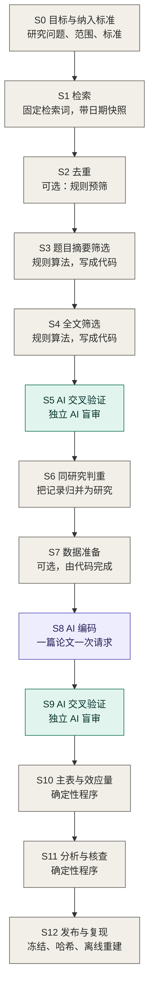
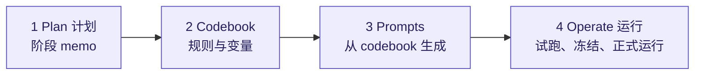

# RAES 操作手册

版本 0.4，草稿。2026-09-23。随 RAES 0.5.0 一同发布。手册和软件分开编号：方法文本变了就更新这个版本号，模板、脚本或 skill 变了就更新软件的版本号。

[English](PROTOCOL.md) | [简体中文](PROTOCOL.zh-CN.md)

本文档介绍我怎样做一项 AI 辅助的证据整合，让其他研究者能够核查其中的每一步。[README](README.zh-CN.md) 给出了简要说明，这里是操作手册。它基于一项已完成的社会科学元分析写成；凡是仅适用于该项目的具体选择，我都在文中作了说明。

本文按照我当面讲解整套工作流的方式展开。第 1 节用一张图概览整个流程。第 2 到 4 节说明谁负责做什么、工作流建立在哪些基础之上，以及贯穿始终的各项原则。第 5 节讲的是：每当某个步骤要调用 AI，我按什么顺序做准备。第 6 节按同样的格式，把图中的每一个阶段展开。

## 1. 流程总览



灰色方框由研究者或确定性程序完成。紫色方框由执行模型在 codebook 的约束下执行。绿色方框是独立的审计模型做的审计。

前半部分遵循 PRISMA 2020 的流程（Page et al., 2021）：识别、筛选、纳入研究。PRISMA 的流程图到此为止。后半部分把同样的要求延伸到编码、效应量、分析和发布。

| 阶段 | 谁来做 | 产出 | PRISMA 2020 阶段 |
|---|---|---|---|
| S0 目标与纳入标准 | 研究者 | 研究问题、编号的纳入标准、结果指标对应表 | 检索之前 |
| S1 检索 | 研究者 | 固定的检索词，带日期的检索快照，含检索式和记录条数 | 识别 |
| S2 去重 | 研究者，在文献管理软件中完成 | 导出为文本文件的去重后文献库、去重前后的数量，以及可选的规则化预筛 | 识别 |
| S3 题目摘要筛选 | 程序 | 每条记录的判断结果与理由 | 筛选 |
| S4 全文筛选 | 程序 | 对每篇已获取全文的论文：逐项标准的证据和最终判断 | 筛选 |
| S5 筛选的 AI 交叉验证 | 审计模型 | 排除样本的审计结果、确认的漏筛，以及由此引发的规则修订 | 筛选 |
| S6 同研究判重 | 程序 | 报告同一项研究的记录分组，每组确定一篇代表性报告 | 纳入 |
| S7 数据准备（可选） | 程序，可选 AI 辅助 | 每篇论文的数据摘要、匹配的对照数据、进度跟踪表 |  |
| S8 AI 编码 | 执行模型 | 每篇论文的编码行，列模板固定 |  |
| S9 编码的 AI 交叉验证 | 审计模型 | 进入分析的每一行的审计结果 |  |
| S10 主表与效应量 | 程序 | 一张包含稳定行编号和已计算效应量的主表 |  |
| S11 分析与统计验证 | 程序 | 分析结果、稳健性检验、独立的数值检查 |  |
| S12 发布与复现 | 程序 | 不可变的发布包、指针、可通过单条命令完成的离线重建 |  |

有两件事贯穿整张图。目标和纳入标准最先确定（S0），因为后续每一个阶段都要引用它们。第二，每一个调用 AI 的步骤都按相同的顺序来准备：计划、codebook、prompt、运行。第 5 节讲这个顺序。

## 2. 适用范围与角色分工

RAES 适用于这样的项目：先按写好的标准筛选文献，再从纳入的研究里编码信息。这包括元分析、系统综述，以及为后续分析建立的文献数据库。它不告诉你怎样设计检索策略，也不告诉你该用哪个统计模型。它告诉你的是如何执行这些步骤，使这些步骤可审计、可复现。

工作流中一共有四个角色。

- **研究者**负责撰写规则，做少量范围受限的裁决，并对结果负责。在我的项目中，研究者就是我本人，因此本文档中凡是提到“我”的地方，都是研究者在说话。
- **执行模型**是负责执行具体规则的模型，比如给一篇论文编码。
- **审计模型**是独立的模型，在看不到原判断的情况下做检查。在条件允许的情况下，它们与执行模型来自不同的模型厂商。
- **确定性程序**负责完成所有能用计算完成的工作：可行时的规则化筛选、检查模型输出、组装表格、计算效应量和统计量。

我所遵循的经验法则是：一个步骤只要能写成程序，就交给程序处理。如果需要阅读理解，就由执行模型在书面规则的约束下完成。如果需要的判断没有任何规则覆盖，我就停下来，先把规则写出来。

## 3. RAES 建立在哪些基础之上

**PRISMA 2020**（Page et al., 2021）。S1 到 S6 阶段沿用它从识别到纳入研究的流程，采用它对记录、报告和研究的区分，并输出其流程图所要求的各项文献数量。

**规则化筛选**（Robleto and Shehadeh, 2025）。他们的方案使用透明的 Python 规则分两个阶段筛选，先看题目摘要，再看全文。S3 和 S4 也采用同样的规则化筛选方式。他们的论文通过在已知的相关论文上测试规则，再人工阅读随机抽取的排除记录样本来验证规则；他们把更严格的定量验证列为下一步。S5 就是我对这一步的尝试：冻结规则和抽样框，把抽样重点放在差一点纳入的记录上，用来自不同模型厂商的审计模型盲审，预先写好停止规则，确认的漏筛通过修订规则来纠正，而不是手工补回。

**关于 AI 用于证据整合的指南。** RAISE 建议（Thomas et al., 2025）以及 Cochrane、Campbell Collaboration、JBI 和环境证据协作组织（Collaboration for Environmental Evidence）联合发布的立场声明（Flemyng et al., 2025），都要求人工监督、透明，并对 AI 的输出做验证。它们明确说明了相关要求。RAES 则是满足这些要求的一种具体做法。

筛选之后的部分是我自己加的，出自我的项目：同研究判重、codebook 约束下的 AI 编码、编码行的交叉验证、只由程序计算的效应量，以及可以离线重建的不可变发布包。

## 4. 原则

**1. 先写 codebook。** 每一项实质性判断，都在正式运行之前写进带版本号的 codebook。prompt 从 codebook 生成。一旦运行暴露出了规则模糊的地方，我就修正规则并更新版本号，不手工修补输出。

**2. AI 执行规则，不决定范围。** 执行模型不得改写、放宽或替换任何一条标准。证据缺失或含糊时，它返回 `null`，并写入未解决事项。它绝不用一个看似合理的值去填空。

**3. 判断的单位是条件，不是论文。** 实验领域的论文里有很多实验组、角色和结果指标。纳入和编码都按条件逐个判断。一篇论文可以被纳入，即便它包含的大多数条件并未被纳入。

**4. 能用确定性程序的，就用确定性程序。** 效应量、标准误和置信区间由程序根据编码得到的输入来计算。执行模型只负责选择计算路径。表格的组装、编号和分析里的每一个统计量也是一样。

**5. 独立审计，并限定每个审计模型能看到什么。** 筛选审计模型看到的是论文和规则，看不到原来的判断和理由。编码审计模型必须看到编码值，因为这正是它要检查的对象；但它看不到执行模型的推理过程，也看不到后续计算得出的任何结果。在全文审计中，两位审计模型独立开展工作，只有在意见不一致时才会调用第三位审计模型。在编码审计中，一位审计模型检查每篇论文，只有在某个值受到质疑时才会调用第二位审计模型，而且第二位审计模型看不到第一位提出的更正建议。人工裁决仅限于明确界定的情况，且必须注明具体的论文页码。

**6. 技术失败不是判断。** 拒答、格式错误的输出、schema 校验失败和超时，都在请求不变的前提下重试。它们永远不算作一次排除、一次通过或一次投票。

**7. 抽样和停止规则事先定好。** 每次验证所使用的抽样框、分层方式、随机种子以及停止条件，都在第一个请求发出之前写下来。

**8. 所有进入正式运行的材料都冻结并记录哈希值。** 规则、prompt、配置、代码和输入文件在运行前都计算哈希并记录在案。其中任何一项发生了可能改变判断的变动，运行就停下。这项变动对应一个新的版本号，并附一条说明，写清它影响什么。受影响的项重新验证。未受影响的结果可以保留，但要先核对它们的输入、身份和规则完全相同。这些结果保留原来的版本号和日期。

**9. 发布包不可变，指针可以移动。** 完成的阶段会保存为带有日期的发布包，之后不再编辑。一个很小的 `CURRENT` 文件指向当前生效的发布包。被取代的材料连同清单一起归档，不删除。

**10. 离线复现。** 每一条模型回答都保存下来。一条命令就能用这些保存好的回答重建全部结果，而且是在断网的情况下。它不重新检索数据库，也不重新询问模型。采集新的模型回答属于独立的步骤，需要明确授权。

**11. 通过属性缓存保证同一实体在不同研究中的编码一致。** 当同一个实体在多项研究中反复出现时，先从缓存中读取它的编码属性，再考虑是否重新评分。缓存和其他规则文件一样带版本号：某个属性一旦修改就会生成新版本，受其影响的所有行都会重新运行。在我的项目中，这些实体是各类 AI 模型，属性则是模型能力和开放程度等指标。

**12. 说清每项验证说明了什么、没有说明什么。** 对抽样的排除记录做的审计如果没有发现问题，它支持的是筛选规则在那一次检索快照上的表现。它不能证明没有漏掉任何符合条件的研究。

## 5. 每个调用 AI 的步骤，我按什么顺序准备



在我的研究项目里，有三个阶段会调用 AI：筛选的交叉验证（S5）、编码（S8）以及编码的交叉验证（S9）。如果你的筛选标准无法写成程序，S3 和 S4 也会调用 AI。每一次准备具体步骤时，我都遵循同样的顺序；前三项没有写成文字之前，不向模型厂商发送任何请求。

### 5.1 计划

这是该阶段的一份简短 memo。它要定下来：这一步回答什么问题；判断单位是什么；模型能看到什么、不能看到什么；模型必须返回什么；哪些模型担任哪个角色；抽样框或样本是什么；重试规则和停止规则；预计成本；怎样才算完成。对于小步骤，这份 memo 只有一页。在我项目里的筛选审计，这份 memo 最终扩展为一份完整的、事先写定的方案。

我让模型根据我对研究项目的描述，起草计划 memo 和第一版 codebook。随后我会逐行阅读，因为后续的编码、针对编码的审计以及分析工作，全部建立在这份文档之上。

### 5.2 Codebook

Codebook 是一个 JSON 文件。它为每个变量提供了名称、描述、允许取的值、示例以及注记。大部分价值都体现在这些注记里：

- 一条可供检查的核心规则；
- 如何把具体文献中特有的测量指标转换成标准尺度；
- 边界情况与反例；
- 一份“不要这样做”的清单；
- 如何记录每个数字的来源出处。

除了变量表，我的编码 codebook 还包含：带操作性澄清的纳入标准；选择对照数据的层级；跨对手或跨抽样设置合并的规则；一份说明，写清哪些字段由模型填、哪些字段由程序算；实体属性“先查缓存”的规则；以及一个版本号字符串。在这个仓库的模板中，标准单独保存在一个文件 `codebook/eligibility.json` 中；codebook 会记录该文件的 SHA-256 哈希值，prompt 生成器从这个文件把原文代入，这样纳入标准就永远不用手工转录。

一个条目的通用示例：

```json
{
  "name": "Outcome_Metric",
  "description": "Canonical outcome label used for the effect size.",
  "allowed_values": ["rate", "share"],
  "example": "share",
  "notes": {
    "core_rule": "Use exactly one label from allowed_values. Higher values must mean more of the target construct.",
    "scale_rule": "Convert amounts to 0-1 shares with a stated denominator. If the denominator is not explicit, leave the numeric inputs null and record the raw statistic.",
    "do_not_use": ["source-specific variable names", "labels that contain 'or'"]
  }
}
```

审计步骤有自己独立的、篇幅更小的 codebook。验证阶段使用的 codebook 会逐字逐句引用纳入标准或编码规则，这些内容从纳入标准文件代入而不是重新打字；它会告诉审计模型该做出怎样的判断，并规定它们必须返回哪些字段。

### 5.3 Prompts

prompt 全部基于 codebook 构建，不包含任何 codebook 里没有的规则。

在编码环节，system prompt 会说明模型角色，说明 codebook 和列模板是唯一依据，禁止编造值，将确定性字段留给程序计算，并列出自我检查清单。针对具体论文的 paper prompt 则提供元数据、输入内容、逐字列出的纳入标准、具体任务、建立一行记录与能够计算效应量之间的区别、必须填写的注记、输出结构，以及预期生成多少行数据的指导。

在审计环节，prompt 只向审计模型提供原始资料和规则，不提供其他任何内容。不能包含哪些内容，第 7 节列出了。

### 5.4 运行

*试跑。* 先只跑几项。在阅读具体的数据行之前，先查看未解决事项、警告信息以及跳过的条件。当执行模型做出了不符合我本意的事情时，关键是要查清是哪一条规则允许它这样做的。

*澄清并更新版本。* 澄清要尽量少，并且保持一般性：它说明现有标准怎样适用于一类反复出现的情形，而不是针对某一篇论文下结论。每一次澄清都会更新版本号字符串，我也会记录下哪些论文需要因此重新运行。

*冻结。* 在正式运行之前，计算并记录规则、prompt、配置、代码和输入的哈希值。

*正式运行。* 工作流配置是一个独立的文件，用于固定操作层面的细节：模型及其参数设置、文件的传递方式、出现分歧时的处理流程、抽样设计与随机种子、重试策略，以及一个确认令牌（没有它就不会发出任何真实请求）。运行程序默认只做离线检查，要加一个明确的开关才会联系模型厂商。运行程序绝不会覆盖先前的输出，保存每一条原始回答，并且中断后可以接着跑，无需重新提交已经处理完毕的项。

### 5.5 贯穿整个项目的顺序

目标与纳入标准、计划 memo、编码 codebook、列模板、prompt、小规模试跑、歧义记录表、最少的澄清并更新版本号、冻结，然后是验证 codebook 和工作流配置，最后是一份可以直接照着执行的 memo，合作者不用问我任何问题就能照做。

## 6. 逐个阶段说明

每个阶段都包含相同的四个部分：谁来做、输入什么与产出什么、我怎么做，以及进入下一阶段前检查什么。调用 AI 的阶段，则按照第 5 节列出的顺序说明我怎么做。

### S0 目标与纳入标准

**谁来做：** 研究者。
**输入：** 研究设想。**产出：** 一份关于研究问题与范围的简要说明、带编号的纳入标准，以及一张对应表，说明每种研究设计要编码哪个结果指标。

**我怎么做。** 这一步在任何检索之前完成。我先把研究的对象和目的写下来，接着写纳入标准，然后再写结果指标对应表。我给各项标准编上号，因为后面的每一个阶段都会按编号引用它们。我的项目有五项标准：任务类型、由谁做决策、结果指标的种类、结果指标如何衡量，以及没有引导行为的指令。随着项目推进，每项标准都会补充操作性澄清：具体哪些情形不满足标准，哪些情形表面上似乎不满足、但实际上满足，以及一篇论文同时含有合格和不合格条件时怎么处理。

**进入下一阶段前。** 我检查两件事。第一，每项标准都能通过阅读论文得出答案：我能指出论文里的哪一段说明它满足或不满足。如果一条标准依赖论文里不会报告的信息，它就没法筛选，也没法审计。第二，各项标准都有版本号。筛选规则、审计 codebook 和编码 codebook 都会逐字抄录这些标准；因此，一旦某项标准发生变动，版本号就能告诉我哪些文件必须更新，以及哪几次运行用的是旧的表述。

### S1 检索

**谁来做：** 研究者。
**输入：** 来自 S0 的研究问题和纳入标准。**产出：** 确定下来的检索词，以及一份标明了日期的检索快照：包含各个数据库、确切的检索式、日期范围、各来源的记录数和原始导出文件。

**我怎么做。** 我在第一次检索前就把检索词定下来并写成文字。每个数据库都用同一套检索词，只针对各个数据库的语法作调整；后续所有的检索更新也同样使用这套词，只调整日期范围。我的项目检索了三个数据库：Web of Science、EBSCOhost 和 arXiv。

每次检索时，我都会记录下检索的数据库、确切的检索式、日期范围，以及来自各个来源的记录数。大多数数据库可以直接导出检索结果。没有导出功能的来源则需要一段简短的脚本。我在处理 arXiv 时就用了一段脚本，它把检索结果保存为文献管理软件可以导入的格式。给每次累计检索一个快照编号，例如 `search_through_2026-04-30`。检索更新会形成新的快照，S5 的审计历史也从头开始。

**进入下一阶段前。** 检索词在不同数据库和历次更新之间保持完全一致。原始导出文件原样保存，且各来源的记录数可以从这些文件中重新生成。

### S2 去重

**谁来做：** 研究者，在文献管理软件中完成。我使用的是 EndNote。
**输入：** 来自各个来源的原始导出文件。**产出：** 一个完成去重的文献库（导出为供筛选程序读取的文本文件），以及去重前后的记录数。

**我怎么做。** 我把来自各个来源的检索结果导入 EndNote，在软件里完成去重，再把文献库导出为一个文本文件。S3 中的筛选程序会解析该文件。我记下导入了多少条记录以及去除了多少条重复记录，因为 PRISMA 流程图要报告这两项数字。

接下来可以执行一个可选步骤：用一条很简单的规则，去掉那些在某个不用阅读的字段上（比如文献类型）就明显不满足纳入标准的记录。举例来说，如果这项整合需要的是报告了数据的研究，那么标题标明是综述的记录就可以在这里直接剔除。在 PRISMA 2020 流程图中，这部分剔除归在“筛选前剔除的记录”一栏下报告，该栏分别列出重复记录数和由自动化工具标记为不合格的记录数。

没有文献管理软件的读者可以使用随 skill 一起提供的去重脚本。它从原始导出文件生成相同的一组输出：记录表、列明每条剔除理由的台账、交由研究者决定的拿不准的记录对，以及各项计数。

导出的文本文件从此刻起成为后续的数据源，电子表格仅用于查看。在我的项目中，电子表格曾悄悄截断了一篇很长的摘要；因此，S3 的运行前检查现在要求被筛选的文本必须与解析出的源文本完全一致。

**进入下一阶段前。** 识别到的记录数等于剔除的记录数加上进入筛选的记录数。预筛规则只有在它去掉的每一条记录我都能说出理由时才保留。不那么明确的记录都留给 S3，在那里它会得到一个理由，也能被审计。

### S3 题目摘要筛选

**谁来做：** 确定性程序，一种规则化算法。
**输入：** S2 导出的文本文件。**产出：** 针对每条记录给出的判断和理由。

**我怎么做。** 和 Robleto and Shehadeh (2025) 一样，这一步的筛选是规则化的。我依据纳入标准来定义筛选规则，并写成 Python 程序。该程序将导出的文本文件解析为一条条记录，然后筛选每条记录的题目和摘要。我自己的程序直接解析 EndNote 的导出文件。这个仓库模板里的程序读的是由该导出文件转换而成的三列表格（包含记录编号、题目和摘要），从而不依赖某一款特定的文献管理软件格式。这一阶段的目标是高召回率。因为筛选使用的是程序，所以同一条记录总能得到相同的判断，规则也可以像代码一样管理版本。如果你的标准无法用这种方式表达，也可以让执行模型在 codebook 约束下筛选，codebook 按照第 5 节的顺序准备。两种情况下，S5 的审计是一样的。

**进入下一阶段前。** 每条记录都有判断和理由。运行前检查确认被筛选的文本与解析出的源文本完全一致。

### S4 全文筛选

**谁来做：** 确定性程序。
**输入：** 通过了 S3 筛选的记录的全文。**产出：** 对每篇已获取全文的论文：逐项标准的证据和最终判断。

**我怎么做。** 这是同一套规则化设计的第二阶段。程序读取从各个 PDF 中提取出来的文本（整个项目使用同一个提取工具并记录其版本号），找出和每条标准有关的段落，并连同证据一起记录各项标准是否得到支持。判断直接由各条标准的结果得出。

**进入下一阶段前。** 保留逐条标准的记录，因为 S5 要用它找出差一点纳入的论文。按照 PRISMA 流程图的要求，未能获取到全文的文献要与因不符合纳入标准而排除的文献分开计数。在筛选保留下来的论文进入编码前，我还会人工通读全部保留的论文，因为单纯依靠词项并不能判定所有标准。不该保留却被保留下来的论文，说明某条全文规则存在错误，这种情况按照 S5 所述的方式处理。

### S5 筛选的 AI 交叉验证

**谁来做：** 独立的审计模型（在我的项目中有三个）；负责抽样、回答验证和多数票判断的程序；做范围受限裁决的研究者。
**输入：** 单次检索快照中 S3 和 S4 的排除记录。**产出：** 完成审计的样本、确认的漏筛，以及它们所带来的改动：一份修订后的全文规则，或者一份冻结清单，列出追加到全文筛选输入里的记录。

这里关注的问题范围很窄：筛选程序是否排除了任何本来应该保留的内容？Robleto and Shehadeh (2025) 建议人工通读一份随机抽取的排除记录样本。这个阶段把这种抽查变成一次事先写定、由独立 AI 执行的审计。

**计划。** 验证 memo 明确了目标（即误排除）和顺序：先验证全文阶段，再验证题目摘要阶段，因为第二次审计的候选对象需要通过已冻结的全文筛选来判定。memo 中还确定了抽样框、分层、每轮数量、随机种子、由哪些审计模型来审、出现分歧时的处理流程、停止规则和重试策略。

**Codebook。** 验证 codebook 逐字引用纳入标准及其操作性澄清，并固定了审计模型必须返回的字段。

**Prompts。** 全文审计模型只接收记录编号、题目和完整的 PDF。摘要审计模型则接收记录编号、题目和摘要。两者都看不到原先的判断及其理由。全文审计模型只答 INCLUDE 或 EXCLUDE，没有第三种回答：凡是论文中未能确立的标准一律视作不成立，因为论文必须证明自己符合标准。审计模型寻找了但未找到的内容，作为解释写入回答中，而不能作为第三种结论。文件不完整或无法读取属于技术失败，不属于排除。

**运行。**

*全文审计。* 从全文排除的记录中抽样，集中在差一点纳入的论文上，我把它定义为恰好只有一条标准不满足的论文。两个来自不同厂商的主审计模型独立工作。只有当两个主审计模型的输出都有效、而且意见不一致时，第三个审计模型才收到同样的材料。多数票判断由程序计算得出。只有当 AI 多数票判定应当纳入时，记录才会提交人工裁决；并且只有在人工决定同样认可并指明具体页码时，才最终确认为误排除。

*题目摘要审计。* 抽取多轮此前未被审计过的排除记录，按检索批次分层。每条记录由一个盲审的审计模型来读。“保留”的回答只是一个候选，不算错误。候选记录取得全文后，先经过冻结的全文筛选；通过的论文再交给独立的审计模型阅读。

*停止。* 每次审计都有自己的停止规则，在发起第一次请求前写入 memo 中。我项目里题目摘要审计的规则是：如果某一轮中没有任何候选对象通过全文筛选，审计即告结束。如果某一轮有候选通过了全文筛选，但全部被独立审计模型排除，这一轮计入累计次数；累计满三轮，审计结束。确认漏筛后审计继续进行，且每出现三个确认的漏筛，就会触发一次针对系统性失败的审查。只有当一轮中的每条记录都有有效回答时，该轮才算完成。缺 PDF、重试用尽或预算暂停，都让这一轮停在未完成；未完成的一轮不能算作没有漏筛的一轮。

*确认漏筛会带来什么改动。* 任何记录都不会通过人工方式加入或移出纳入名单。纳入名单始终是规则运行出来的结果。一轮审计进行期间规则保持不变，运行结束后再做修订。

- 全文审计确认的漏筛，说明某条全文规则错了。我会对规则做最小的一般性修订，赋予其新版本号，在所有论文上重新运行全文筛选，归档当前的审计运行记录，并在新规则下冻结一份全新的样本。这篇论文只有在修订后的规则纳入它时才算纳入。在同一个快照里，已经实际开始过的运行用到的记录，不再进入之后的样本。
- 题目摘要规则保持冻结，因为改动它们会改变后续所有阶段的输入。在题目摘要审计中确认的记录会进入一份冻结清单，全文筛选程序会读取该清单作为追加输入，由全文规则来判断。这个仓库模板中的筛选程序使用 `--after-ta-audit` 参数读取该清单。
- 误纳入和误排除一样处理，不论它在哪里暴露出来：在查看保留论文时、在编码期间，还是在编码审计中。全文规则会被修订并重新运行。如果标准本身不够清晰，纳入标准文件里的澄清也一并修订。
- 当我测试修订后的规则时，我不要求以前排除的记录必须仍然被排除。没有人读过的排除，不能当作排除得对。

**进入下一阶段前。** 在当前规则版本下已满足停止规则。所有确认的漏筛均已被当前规则纳入，程序跑一遍就能重现纳入名单。

### S6 同研究判重

**谁来做：** 程序；拿不准的记录对由研究者对照原文确认。
**输入：** S5 之后的纳入记录。**产出：** 报告同一项研究的记录分组、各组的代表性报告，以及从记录到研究的对应关系。

**我怎么做。** 证据整合的基本单位是研究，而不是报告（Lefebvre et al., 2025，第 4.6 节；PRISMA 2020 对记录、报告和研究做了同样的区分）。同一项研究的预印本、会议版和期刊版会作为不同的记录出现。程序依据书面设定的阈值，对比每对纳入记录的题目相似度、作者列表，以及全文的相似度与相对长度。程序把匹配的记录分成组，再按写好的规则选出代表性报告：已发表版本优先，之后是较晚的版本。代表性报告就是在表格中代表该研究的记录。其他报告继续与它保持关联；对于只有预印本或补充材料报告的值，则按照 codebook 中写明的来源优先级从中提取。选出代表性报告是为了对同一批被试仅计算一次；这并不会把其他报告丢弃。在我的项目里，检索截至 2026-09-06，85 条纳入记录对应 72 项研究。

**进入下一阶段前。** 每条记录恰好属于一个组，每个组恰好有一个代表性报告。如果某个阈值改了，原来的结果保留，新规则对所有记录对重新运行。没有任何一对记录是手工合并的：拿不准的记录对由我对照原文确认，写下证据，再由程序执行这个确认。

### S7 数据准备（可选）

**谁来做：** 程序；涉及数据索取时由研究者负责。AI 可以协助。
**输入：** 纳入的研究及其提供的所有数据。**产出：** 针对每篇论文的数据摘要、匹配好的对照数据，以及一份跟踪表。

**我怎么做。** 只有当论文附带数据文件，或者需要匹配对照数据时，才用到这个阶段。统计量全部在正文中呈现的论文跳过这一步。设立该阶段的原因在于成本和准确性：原始数据文件可能很长，发给模型的成本高，而且不应该让模型做算术。因此，程序会把数据浓缩为简短的摘要，S8 的执行模型读的就是这份摘要。

AI 可以协助完成这一阶段，例如阅读数据仓库并编写处理脚本。在协助时，必须向它提供与筛选和编码阶段逐字一致的纳入标准，以确保它准备的条件与符合纳入标准的条件完全一致。

1. 寻找可用数据：论文报告的统计量、补充材料、数据仓库。如果没有，记录缺失内容，发送数据索取请求，将论文标记为等待中，然后继续处理其他论文。该论文留在编码队列里。作者发来的数据文件和其他数据一样在这个阶段处理。作者提供的单个修正值或已发表的勘误，通过 S9 的核对与更正记录进入，并注明来源。
2. 从正文里列出合格的条件。仅在数据仓库中出现的额外条件不会被自动纳入。
3. 按照固定的层级匹配对照数据。我的层级是：同篇论文的数据，然后是论文明确指出的来源，最后是全项目通用的基线库。允许出现找不到匹配项的情况。保留该行，效应量留空，不参与计算。
4. 在各个独立单位内部做合并，写出每篇论文一份摘要文件。重复轮次不能算作独立观测。

**进入下一阶段前。** 条数、样本量和匹配关系都经过独立核对。跟踪表把四种状态分开记录：材料已查看、数据可得、准备完成、编码已运行。完成准备不等于完成编码。

### S8 AI 编码

**谁来做：** AI 执行模型，在 codebook 约束下；程序负责验证回答并写入各行。
**输入：** 每篇论文对应的主 PDF、补充材料、准备好的数据摘要、完整 codebook、列模板、对照数据库和实体缓存。**产出：** 按固定列模板生成的每篇论文编码行。

**计划。** 每次请求处理一篇论文。编码的基本单位是条件。memo 明确了上述各项输入、输出格式要求、模型及其设置、试跑用哪几篇、预期成本以及重新运行的规则。

**Codebook。** 第 5.2 节所述的编码 codebook。

**Prompts。** 第 5.3 节所述的 system prompt 和 paper prompt。

**运行。** 按第 5.4 节试跑、澄清、更新版本、冻结，然后正式运行。执行模型返回一个 JSON 对象，其中包含：

- 编码行，每行的列和模板完全一致；
- 一份简要说明，指出哪些行具备计算效应量的充分信息；
- 注记，为每一个靠判断得出的调节变量给出理由；
- 跳过的条件，每项均附带未满足的标准；
- 警告与未解决事项；
- 对照 codebook 完成的自查。

即使缺少统计量，也照样建行。数值字段填 `null`，缺失的部分记录为未解决事项。执行模型绝不计算效应量。

运行程序不会覆盖先前的输出，它会保存原始回答，并报告 token 使用量。另有一个单独的步骤检查 JSON 并写入编码行。如果长表格被截断，我会改变输出的传递方式（例如作为文件提供），而绝不人工补齐缺失的行。重跑必须有记录在案的理由，先前的输出要归档。

**进入下一阶段前。** 队列中的每篇论文要么拥有经过验证的行，要么有记录在案的等待理由。

### S9 编码的 AI 交叉验证

**谁来做：** 一个 AI 审计模型，与执行模型来自不同厂商；第二个盲审的 AI 裁决者；以及做范围受限裁决的研究者。
**输入：** 供后续分析使用的冻结行集合。**产出：** 针对每一行的审计结果，以及确认的更正项。

**计划。** 冻结供后续分析使用的全部行，其中效应量字段留空并对审计模型隐藏。每篇论文从三个方面进行检查：效应量输入值、每行与对照行的配对及所选的计算路径，以及调节变量。审计模型不能增加、删除、拆分或合并行，也不能重新讨论是否纳入。

**Codebook。** 审计模型默认返回“通过”，除非原始材料和冻结的规则支持在某一行、某一个字段上做一处具体的更正。

**Prompts。** 审计模型看到原始材料、冻结的规则和编码行。处理质疑的裁决者看到同样的材料，以及被质疑的字段及其当前值，但看不到审计模型提出的值，也看不到支持这个值的证据。

**运行。** 每项质疑都提交给盲审裁决者，裁决者返回三种结果之一。*当前编码成立：* 质疑被驳回，维持原编码。由于两个独立的解读结果一致，因此无需人工介入。*更正成立：* 只有当裁决者给出的更正值与审计模型提出、但裁决者不可见的值完全一致时，更正才算确认。出现任何差异均交由研究者做范围受限的裁决。*原始材料或规则有歧义：* 该项交由研究者做范围受限的裁决。

确认的错误通过两条途径之一处理。如果错误仅涉及某一篇论文，而相关规则本来就清楚，程序就按一条核对与更正记录来更正，记录里保留改前和改后的值。如果错误暴露出规则不清或有错，就在 codebook 里改：最小的一般性修改，更新版本，受这条规则影响的论文重新编码。不单独修改个别行。在规则不变的情况下再次运行编码模型，仅适用于技术失败。这不是修复内容错误的方法，因为同一个模型产生的错误并不是相互独立的，而只留下“看起来对”的那一次，等于按结果挑选。

审计程序绝不修改正式的数据行。在 codebook 补充澄清之后，仅对受影响的论文重新审计，先前的“通过”结果保留它们当时依据的 codebook 版本。

**进入下一阶段前。** 冻结框内的每一行都有审计结果。

### S10 主表与效应量

**谁来做：** 程序。
**输入：** 单篇论文的输出和确认的更正项。**产出：** 包含稳定行编号和已计算效应量的主表。

**我怎么做。** 程序根据单篇论文的输出构建主表。登记表会为每一行分配一个稳定的编号。常规构建是只读的，遇到未登记的行会报错终止；分配新编号需要一个明确的开关；废弃的编号绝不重复使用。确定性引擎负责计算效应量。我的引擎包含三条路径：均值与标准差、事件发生次数，以及论文报告的配对检验统计量。在我的项目中，72 项研究都编了码；其中 54 项报告了计算效应量所需的统计量，贡献了 757 个效应量，其余 18 项编了码，但没有可以计算的比较，其中一些是因为还在等作者提供数据。

**进入下一阶段前。** 每个效应量都由另外单独写的脚本，从存好的输入重算一遍。合并结果在另一个统计软件里交叉核对，那属于 S11。

### S11 分析与统计验证

**谁来做：** 程序。
**输入：** 冻结的主表，不包含其他任何内容。**产出：** 研究结果、稳健性检验，以及独立的数值核对。

**我怎么做。** 在主要分析之外，我还运行一系列检验，考察研究结论是否依赖于特定的构建选择：同一篇论文的效应量之间的相依性、效应量与调节变量的其他构建方式、对对照数据来源的敏感性、发表偏倚诊断，以及设计检验力。

**进入下一阶段前。** 每个分析模块结束时，都对报告出来的值做一次独立的数值核对。

### S12 发布与复现

**谁来做：** 程序。
**输入：** 每一个已完成的阶段。**产出：** 不可变发布包、指针，以及一条可在离线状态下重建全部结果的命令。

**我怎么做。** 每个完成的阶段都会保存为一个带有日期和哈希清单的不可变发布包。发布包可以是一份文件副本，也可以是原地记录的文件哈希清单，后一种做法不会在同步文件夹里把一个大项目再复制一遍。清单记录的是哈希值而非文件内容：它能说明一个文件是否仍与发布时一致；而版本控制系统中的项目历史，或是归档副本，才是找回早期状态的依据。`CURRENT` 文件写明当前生效的发布包，启用记录说明工作副本里改了什么。项目状态文件将已完成的工作标为完成，不额外推断或添加后续步骤。

**进入下一阶段前。** 一条命令把正式输入复制到一个全新的位置，断开网络，用保存的回答重建结果。软件环境和可丢弃的缓存放在同步文件夹之外。

## 7. 适用于每次审计的规则

**盲审。** 筛选审计模型拿到原始材料和规则。它们拿不到最初的判断及其理由、抽样排位、批次、关键词标记，也看不到任何后续的结果。编码审计模型拿到原始材料、规则和已编码的行，但拿不到执行模型的推理过程或计算出的任何效应量。当某个编码值受到质疑时，第二个审计模型看到同样的材料、被质疑的字段和它的当前值，但看不到第一个审计模型提出的值和支持这个值的证据。

**分阶段执行。** 审计模型按固定顺序运行，每个审计模型运行后都设有一个检查点。设置这些检查点，是为了在为所有审计模型付费之前发现 schema 校验失败和模型厂商报错。这些检查点不用于决定哪些记录继续进入后续审计。不允许往下一个审计模型的队列里添加记录，也不允许从中拿掉记录。

**技术失败。** 每次调用，对每个未解决事项只允许有限的一批新尝试。尝试的编号跨调用接着递增，请求保持不变，总次数不设固定上限；阶段 memo 里批准的预算限定总量，超出预算的尝试需要重新批准。如果原始回答包含多个 JSON 对象，只有当其中恰好一个通过全部检查时才接受。原始回答始终保留。

**通过意味着什么。** 对于筛选来说：在冻结的规则下，针对该次检索快照，审计样本中没有确认的误排除。对于编码来说：审计的行与原始材料及冻结的规则相一致。它不审计从未编码过的论文或条件，也不是对全部文献的第二次完整编码。

## 8. 我在论文中报告的内容

- 执行模型和审计模型、各自的版本与设置，以及运行的日期。
- codebook 和 prompt 的版本，以及在哪里能找到它们。
- 哪些步骤采用了确定性程序，哪些步骤使用了模型。
- 每次验证的具体情况：抽样框、分层、样本量、随机种子、停止规则和结果，包括确认的漏筛与确认的更正。
- 技术失败的次数及处理方式。
- 人工裁决的次数与范围。
- 每次规则变更的时间，以及它与可能受影响结果之间的先后关系。
- 重建结果所用的命令，以及该命令涵盖的范围。
- 每项验证不能说明什么。

## 9. 把 RAES 用到别的领域

替换内容部分：纳入标准、结果指标对应表、codebook 变量、对照数据、实体缓存和筛选规则。保留结构部分：各角色、各项原则、阶段顺序、每个 AI 步骤的四步准备法、验证设计以及发布约定。在新领域中，一个合理的第一里程碑是：一份 codebook 在对 5 到 10 篇论文进行试跑后不再需要新增澄清。

## 10. 局限性

这些验证是有针对性的检查，不能证明零错误。来自不同厂商的审计模型仍可能存在共同的盲区。规则化筛选依赖规则所查找的词，这就是为什么 S3 以高召回率为目标，而 S5 审计被排除的记录。在给任何论文编码之前，写规则确实要花功夫；只有当文献体量庞大或后续需要更新时，这种方法才划算。模型会发生变化，因此必须锁定并记录具体版本。受版权保护的原始材料，以及作者提供的数据（除非得到作者同意），都不能分享，这限制了外部研究者能够从头复现到什么程度。

## 附录 A. 术语表

- **Codebook：** 带版本号的文件，定义每个变量、每条规则和对输出的要求。
- **条件：** 纳入与编码的单位，由研究项目的 codebook 定义；在我的项目中，指单篇论文内的一个实验组、角色和结果指标。
- **执行模型：** 应用 codebook 的模型。
- **审计模型：** 独立盲审某项判断的模型。
- **交叉验证：** 在本文里，指由独立的模型对一个程序或一个模型的判断做盲审。它与机器学习中的 k 折交叉验证无关。
- **差一点纳入：** 在全文阶段被排除、且恰好只有一条标准不满足的论文。
- **误排除：** 在本应保留的阶段被排除的记录。
- **快照：** 检索的一个累积状态，拥有自己的编号和审计历史。
- **冻结框：** 一次验证所针对的那一组固定的行或记录。
- **代表性报告：** 在表格中代表某项研究的记录；这项研究的其他报告仍和它关联在一起。
- **核对与更正记录：** 记录经确认更正的文件，包含更正前后的值、支持证据及其来源；更正只能通过该记录进入主表。
- **发布包：** 一个已完成阶段不可变且带日期的记录：可以是该阶段文件的副本，也可以是其哈希清单。
- **指针：** 指明当前生效发布包的 `CURRENT` 文件。

## 附录 B. 文件夹约定

```text
search/                  检索式、导出文件、条数
screening/               筛选规则、输出、验证运行、同研究判重
papers/<paper_id>/       input_pdf/, input_supplement/, input_author_data/, ai_output/
codebook/                带版本号的 codebook 文件
prompts/                 system prompt 和 paper prompt
templates/               列模板
validation/              冻结框、运行记录、核对记录
table_build/             行编号登记表、发布包、启用记录
analysis/                脚本、发布包、验证发布包
archive/                 被取代的材料及其清单
CURRENT_STATUS.md        已完成的工作和当前范围
```

## 参考文献

Flemyng, E., Noel-Storr, A., Macura, B., Gartlehner, G., Thomas, J., Meerpohl, J. J., Jordan, Z., Minx, J., Eisele-Metzger, A., Hamel, C., Jemioło, P., Porritt, K., & Grainger, M. (2025). Position statement on artificial intelligence (AI) use in evidence synthesis across Cochrane, the Campbell Collaboration, JBI and the Collaboration for Environmental Evidence 2025. *Environmental Evidence*. https://doi.org/10.1186/s13750-025-00374-5 (co-published in the *Cochrane Database of Systematic Reviews*, *Campbell Systematic Reviews* and *JBI Evidence Synthesis*)

Lefebvre, C., Glanville, J., Briscoe, S., Featherstone, R., Littlewood, A., Metzendorf, M.-I., Noel-Storr, A., Paynter, R., Rader, T., Thomas, J., & Wieland, L. S. (2025). Chapter 4: Searching for and selecting studies. In J. P. T. Higgins, J. Thomas, J. Chandler, M. Cumpston, T. Li, M. J. Page, & V. A. Welch (Eds.), *Cochrane Handbook for Systematic Reviews of Interventions* (version 6.5.1). Cochrane.

Page, M. J., McKenzie, J. E., Bossuyt, P. M., Boutron, I., Hoffmann, T. C., Mulrow, C. D., et al. (2021). The PRISMA 2020 statement: An updated guideline for reporting systematic reviews. *BMJ*, 372, n71. https://doi.org/10.1136/bmj.n71

Robleto, E., & Shehadeh, L. A. (2025). Accelerating systematic reviews: A novel 1-wk screening protocol using rule-based automation with AI-assisted Python coding. *American Journal of Physiology-Heart and Circulatory Physiology*, 329(5), H1391–H1413. https://doi.org/10.1152/ajpheart.00374.2025

Thomas, J., Flemyng, E., Noel-Storr, A., et al. (2025). *Responsible use of AI in evidence SynthEsis (RAISE): Recommendations and guidance*. Open Science Framework. https://doi.org/10.17605/OSF.IO/FWAUD


本文件以 CC BY 4.0 发布，见 [LICENSE-docs.md](LICENSE-docs.md)。
