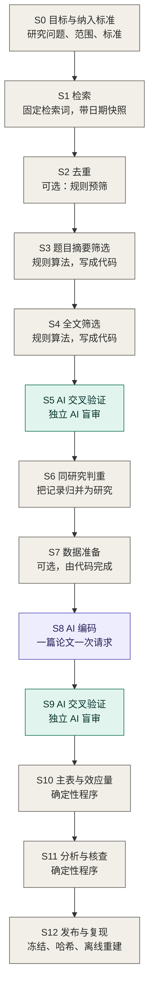
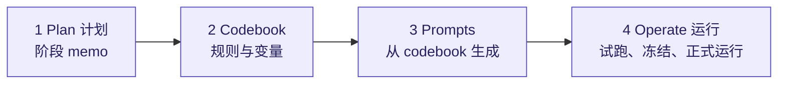

# RAES 操作手册

[English](PROTOCOL.md) | [简体中文](PROTOCOL.zh-CN.md)

本文件是英文版 `PROTOCOL.md`（0.3 草稿，2026-09-18）的逐段翻译。两者不一致时以英文为准。

这份文件讲的是：我怎样做一项 AI 辅助的证据整合，并且让别的研究者能检查其中每一步。[README](README.zh-CN.md) 是简短版，这里是操作手册。它来自一个已经完成的项目，一项社会科学的 meta-analysis。哪些做法只属于那个项目，我会说明。

文件的顺序，就是我当面向人解释这套流程时的顺序。第 1 节用一张图展示整个流程。第 2 到 4 节讲谁做什么、这套流程建立在什么之上、哪些原则贯穿始终。第 5 节讲每次要调用 AI 之前，我按什么顺序做准备。第 6 节按同一个格式，把图里的每个阶段展开。

## 1. 流程总览



灰色的格子由研究者或确定性程序完成。紫色的格子由 AI 在 codebook 约束下执行。绿色的格子是独立 AI 的审计。

前半段沿用 PRISMA 2020 的流程（Page et al., 2021）：识别、筛选、纳入研究。PRISMA 的流程图到这里就结束了。后面的阶段把同样的要求用到编码、效应量、分析和发布上。

| 阶段 | 谁来做 | 产出 | PRISMA 2020 阶段 |
|---|---|---|---|
| S0 目标与纳入标准 | 研究者 | 研究问题、带编号的纳入标准、结果指标对应表 | 检索之前 |
| S1 检索 | 研究者 | 固定的检索词；带日期的检索快照，含检索式和条数 | 识别 |
| S2 去重 | 研究者，在文献管理软件里 | 去重后的文献库，导出为文本文件；去重前后的条数；可选的规则预筛 | 识别 |
| S3 题目摘要筛选 | 程序 | 每条记录的判断和理由 | 筛选 |
| S4 全文筛选 | 程序 | 每篇取得全文的论文：逐条标准的证据，加一个判断 | 筛选 |
| S5 筛选的 AI 交叉验证 | AI 审计者 | 被审计的排除样本、确认的漏筛，以及由此引起的规则修订 | 筛选 |
| S6 同研究判重 | 程序 | 报告同一研究的记录分组，每组一个代表 | 纳入 |
| S7 数据准备（可选） | 程序，可以用 AI 辅助 | 逐篇的数据摘要、匹配好的对照数据、进度跟踪表 | |
| S8 AI 编码 | AI 执行模型 | 逐篇的编码行，列结构固定 | |
| S9 编码的 AI 交叉验证 | AI 审计者 | 进入分析的每一行的审计结果 | |
| S10 主表与效应量 | 程序 | 一张主表，行编号稳定，效应量已算好 | |
| S11 分析与统计验证 | 程序 | 结果、稳健性检验、独立的数值核对 | |
| S12 发布与复现 | 程序 | 不可变的发布包、指针、一条离线重建的命令 | |

有两件事贯穿整张图。第一，研究目标和纳入标准最先确定（S0），因为后面每个阶段都要引用它们。第二，每个调用 AI 的环节都按同一个顺序准备：计划、codebook、prompt、运行。第 5 节讲这个顺序。

## 2. 适用范围与角色

RAES 适用于这样的项目：先按写好的标准筛选文献，再从纳入的研究里编码信息。包括 meta-analysis、系统综述，以及为后续分析建立的文献数据库。它不告诉你怎样设计检索策略，也不告诉你用哪个统计模型。它告诉你怎样执行这些步骤，使它们能被审计、能被复现。

一共四个角色。

- **研究者**写规则，做少量范围受限的裁决，并对结果负责。在我的项目里，研究者就是我。所以本文里凡是写"我"的地方，都是研究者在说话。
- **执行模型（executor）**是执行规则的模型，比如给一篇论文编码的那个模型。
- **审计者（auditors）**是独立的模型，在看不到原判断的情况下检查工作。条件允许时，它们来自和执行模型不同的厂商。
- **确定性程序**负责一切能算出来的事：可行时的规则化筛选、检查模型输出、组装表格、计算效应量和统计量。

我用的经验法则是：一个步骤如果能写成代码，就写成代码。如果需要阅读理解，就交给执行模型，在写好的规则下做。如果需要的判断没有任何规则覆盖，我就停下来，先把规则写出来。

## 3. RAES 建立在什么之上

**PRISMA 2020**（Page et al., 2021）。S1 到 S6 沿用它从"识别"到"纳入研究"的流程，采用它对记录（record）、报告（report）和研究（study）的区分，并产出它的流程图所需要的各项条数。

**规则化筛选**（Robleto and Shehadeh, 2025）。他们的方案用透明的 Python 规则分两个阶段筛选，先筛题目和摘要，再筛全文。S3 和 S4 同样是规则化的。他们验证规则的办法，是先用已知相关的论文测试，再抽一些被排除的记录来读；他们把更严格的定量验证列为下一步。S5 是我对这一步的尝试：规则和抽样框冻结，分层抽样集中在差一点就纳入的论文上，由不同厂商的审计者盲审，停止规则事先写定，确认的漏筛通过修订规则来纠正，而不是手工补回。

**关于 AI 用于证据整合的指南。** RAISE 建议（Thomas et al., 2025），以及 Cochrane、Campbell Collaboration、JBI 和环境证据协作组织的联合立场声明（Flemyng et al., 2025），都要求人工监督、透明，以及对 AI 输出做验证。它们说明了要求是什么。RAES 是一种具体的做法。

筛选之后的部分是我自己加的，出自我的项目：同研究判重、codebook 约束下的 AI 编码、对编码行的交叉验证、只由程序计算的效应量，以及可以离线重建的不可变发布包。

## 4. 原则

**1. Codebook 先行。** 每一个实质判断，都在正式运行之前写进带版本号的 codebook。Prompt 从 codebook 生成。运行中发现规则有歧义时，我改规则并升版本，不手工修补输出。

**2. AI 执行规则，不设定范围。** 执行模型不得改写、放宽或替换任何标准。证据缺失或含糊时，它返回 `null`，并记录一条未解决项。它绝不用一个看似合理的值去填空。

**3. 判断单位是条件，不是论文。** 实验类论文里有很多实验组、角色和结果指标。纳入和编码都逐个判断。一篇论文可以被纳入，而其中大部分条件不纳入。

**4. 能确定性的就确定性。** 效应量、标准误和置信区间，由程序根据编码得到的输入来计算。执行模型只选择计算路径。表格组装、编号和分析里的每个统计量也是一样。

**5. 独立审计，并限定每位审计者能看到什么。** 筛选审计者看到论文和规则，看不到原来的判断和理由。编码审计者必须看到编码值，因为它要检查的就是这些值；它看不到执行模型的理由，也看不到之后算出来的任何结果。全文审计里，两位审计者独立工作，只有两人意见不一致时才引入第三位。编码审计里，一位审计者检查每一篇论文，只有某个值被质疑时才引入第二位；第二位看不到第一位提出的改法。人工裁决只限于事先定义的情形，并且必须给出页码。

**6. 技术失败不是判断。** 拒答、格式错误、schema 不符和超时，都在请求不变的前提下重试。它们永远不算作一次排除、一次通过或一票。

**7. 抽样和停止规则事先写定。** 每项验证的抽样框、分层、随机种子和停止条件，都在第一个请求发出之前写下来。

**8. 进入正式运行的一切都冻结并留哈希。** 规则、prompt、配置、代码和输入文件，运行前都带哈希记录下来。其中任何一项发生了可能改变判断的变动，运行就停下。这个变动得到一个新版本号，并附一条说明，写清它影响什么。受影响的部分重新验证。未受影响的结果可以保留，但要先核对它们的输入、身份和规则完全相同。它们保留原来的版本和日期。

**9. 发布包不可变，指针可以移动。** 完成的阶段保存为带日期的发布包，此后不再编辑。一个小的 `CURRENT` 文件指向当前生效的发布包。被取代的材料连同清单一起归档，不删除。

**10. 离线可复现。** 每一条模型回答都保存下来。一条命令用这些保存的回答重建全部结果，并且断开网络。它不重新检索数据库，也不重新询问模型。收集新的回答是另一个步骤，需要明确批准。

**11. 用缓存保证同一实体在各研究里一致。** 同一个实体出现在多篇研究里时，先到缓存里查它的编码属性，而不是重新打分。在我的项目里，实体是 AI 模型，属性是模型强度、开放程度这类指标。

**12. 说清每项验证证明了什么、没证明什么。** 对抽中的排除记录做的审计如果是干净的，它支持的是这一版筛选规则在这一个检索快照上的表现。它不能证明没有漏掉任何合格的研究。

## 5. 每个调用 AI 的环节，我按什么顺序准备



在我的项目里，有三个阶段调用 AI：筛选的交叉验证（S5）、编码（S8）和编码的交叉验证（S9）。如果你的筛选标准写不成代码，S3 和 S4 也会调用 AI。每一次我都按同一个顺序准备。前三样东西没有写成文字之前，不向任何模型厂商发送请求。

### 5.1 Plan（计划）

为这个阶段写一份简短的 memo。它要定下来：这一步回答什么问题；判断单位是什么；模型能看到什么、不能看到什么；模型必须返回什么；哪些模型担任哪个角色；总体或样本是什么；重试规则和停止规则；预计成本；怎样才算完成。小的步骤，一页就够。我项目里的筛选审计，这份 memo 最后长成了一份完整的、事先写定的方案。

我让模型根据我对项目的描述，起草计划 memo 和第一版 codebook。然后我逐行读，因为整个项目的其余部分都建立在 codebook 这一份文件上。

### 5.2 Codebook

Codebook 是一个 JSON 文件。它为每个变量给出名称、说明、允许的取值、一个例子和注记。最有价值的是注记：

- 一条可以检验的核心规则；
- 怎样把各论文自己的度量换算成统一的尺度；
- 边界情形和反例；
- 一份"不要这样做"的清单；
- 怎样记录每个数字的出处。

除了变量表，我的编码 codebook 还包含：带操作性澄清的纳入标准；选择对照数据的层级；跨对手或跨抽样设置的合并规则；一份说明，写清哪些字段由模型填、哪些字段由程序算；实体属性"先查缓存"的规则；以及一个版本号。

一个通用的变量条目示例：

```json
{
  "name": "Outcome_Metric",
  "description": "Canonical outcome label used for the effect size.",
  "allowed_values": ["rate", "share"],
  "example": "share",
  "notes": {
    "core_rule": "Use exactly one label from allowed_values. Higher values must mean more of the target construct.",
    "scale_rule": "Convert amounts to 0-1 shares with a stated denominator. If the denominator is not explicit, leave the numeric inputs null and record the raw statistic.",
    "do_not_use": ["source-specific variable names", "labels that contain 'or'"]
  }
}
```

审计环节有它自己的、更小的 codebook。这份验证 codebook 逐字引用纳入标准或编码规则，告诉审计者要判断什么，并规定它们必须返回哪些字段。

### 5.3 Prompts

Prompt 从 codebook 生成，不包含任何 codebook 里没有的规则。

编码用的 prompt 分两份。System prompt 说明角色；说明 codebook 和列模板是唯一依据；禁止编造数值；把确定性字段留给程序；并列出自检清单。Paper prompt 提供：论文的元数据、输入材料、逐字引用的纳入标准、任务、"建一行"和"能算出效应量"的区别、必须写的注记、输出结构，以及大约应该有多少行的说明。

审计用的 prompt 只给审计者原始材料和规则，别的什么都不给。不能包含哪些内容，见第 7 节。

### 5.4 Operate（运行）

*试跑。* 先跑几篇。读编码行之前，先读未解决项、警告和被跳过的条件。如果执行模型做了我没打算让它做的事，要问的问题是：哪条规则允许了它这样做。

*澄清并升版本。* 澄清要尽量少，并且是一般性的：它说明现有标准怎样适用于一类反复出现的情形，而不是对某一篇论文下结论。每次澄清都会改变版本号，我同时记下哪些论文因此需要重跑。

*冻结。* 正式运行之前，把规则、prompt、配置、代码和输入都带哈希记录下来。

*正式运行。* 工作流配置是一个单独的文件，它定下操作层面的事：用哪些模型、什么设置；文件怎样传给模型；意见不一致时怎样流转；抽样设计和随机种子；重试策略；以及一个确认令牌，没有它就不会发出任何真实请求。运行程序默认只做离线检查，要加一个明确的开关才会联系模型厂商。它们从不覆盖已有的输出，保存每一条原始回答，中断后可以接着跑，不会重复提交已经完成的项目。

### 5.5 整个项目的先后顺序

研究目标和纳入标准，计划 memo，编码 codebook，列模板，prompt，小样本试跑，歧义记录，带新版本号的最小澄清，冻结，然后是验证 codebook 和工作流配置，最后是一份"可以直接照着执行"的 memo：合作者不用问我任何问题就能照做。

## 6. 逐个阶段

每个阶段都有同样的四部分：谁来做；输入什么、产出什么；我怎么做；进入下一步之前我检查什么。调用 AI 的阶段，"我怎么做"按第 5 节的顺序写。

### S0 目标与纳入标准

**谁来做：** 研究者。
**输入：** 研究想法。**产出：** 一段简短的文字说明研究问题和范围；带编号的纳入标准；一张对应表，说明每种研究设计要编码哪个结果指标。

**我怎么做。** 这一步在任何检索之前。我先写下研究的是什么、为了什么目的，然后写纳入标准，然后写结果指标对应表。我给标准编号，因为后面每个阶段都用编号来引用它们。我的项目有五条：任务的类型、由谁做决定、结果的种类、结果怎样测量，以及没有引导行为的指令。随着项目推进，每条标准都会得到操作性的澄清：具体哪些情形不满足，哪些情形看起来不满足其实满足，以及一篇论文同时含有合格和不合格条件时怎么办。

**进入下一步之前。** 我检查两件事。第一，每条标准都能靠读论文来回答：我能指出论文里的哪一段说明它满足或不满足。如果一条标准依赖论文里不会报告的信息，它就没法筛选，也没法审计。第二，标准有版本号。筛选规则、审计用的 codebook 和编码用的 codebook 都逐字照抄这些标准。所以当某条标准改动时，版本号告诉我哪些文件必须跟着改，哪几次运行用的是旧的写法。

### S1 检索

**谁来做：** 研究者。
**输入：** S0 的研究问题和纳入标准。**产出：** 固定的检索词；一份带日期的检索快照，含数据库、确切的检索式、日期范围、每个来源的记录条数，以及原始导出文件。

**我怎么做。** 第一次检索之前，我先把检索词定下来并写下来。每个数据库都用同一套检索词，只按各库的语法做调整。之后每次更新检索也用同一套，只改日期范围。我的项目检索三个数据库：Web of Science、EBSCOhost 和 arXiv。

每次检索，我记录数据库、确切的检索式、日期范围和每个来源的记录条数。大多数数据库可以直接导出结果。没有导出功能的来源需要一个小脚本。我给 arXiv 用了一个，它把结果存成文献管理软件能导入的格式。给每次累计检索一个快照编号，比如 `search_through_2026-04-30`。更新检索就是一个新的快照，S5 的审计历史也随之重新开始。

**进入下一步之前。** 检索词在各数据库之间、各次更新之间完全一致。原始导出文件原样保存，每个来源的条数可以从这些文件重新数出来。

### S2 去重

**谁来做：** 研究者，在文献管理软件里完成。我用 EndNote。
**输入：** 每个来源的原始导出文件。**产出：** 一个去重后的文献库，导出为筛选程序读取的文本文件；以及去重前后的记录条数。

**我怎么做。** 我把每个来源的检索结果导入 EndNote，在那里去重，然后把文献库导出为一个文本文件。S3 的筛选程序解析这个文件。我记下进来多少条、去掉多少条重复，因为 PRISMA 流程图两个数都要报告。

之后可以有一个可选步骤：用一条很简单的规则，去掉那些在某个不需要阅读的字段上就明显不满足纳入标准的记录，比如文献类型。举例来说，如果这项整合需要的是报告数据的研究，那么标题表明自己是综述的记录可以在这里去掉。在 PRISMA 2020 的流程图里，这些去除报告在"筛选前去除的记录"一栏，该栏有一行是重复记录，一行是被自动化工具标为不合格的记录。

没有文献管理软件的读者，可以用 skill 自带的去重脚本。它从原始导出文件产出同样的东西：记录表、写明每条记录为什么被去掉的台账、它拿不准而留给研究者决定的配对，以及各项数量。

从这里开始，导出的文本文件就是原始依据，电子表格只用来查看。我的项目里，电子表格曾经悄悄截断过一条很长的摘要。所以 S3 的运行前检查现在要求：被筛选的文本和解析出来的原文必须完全相同。

**进入下一步之前。** 识别到的记录数，等于去掉的记录数加上进入筛选的记录数。预筛规则只有在它去掉的每一条我都能辩护时才保留。不那么明确的，都留给 S3，在那里它会得到一个理由，也能被审计。

### S3 题目摘要筛选

**谁来做：** 确定性程序，一个规则算法。
**输入：** S2 导出的文本文件。**产出：** 每条记录的判断和理由。

**我怎么做。** 这一步的筛选是规则化的，和 Robleto and Shehadeh (2025) 一样。我根据纳入标准定出筛选规则，把它们写成一个 Python 程序。程序把导出的文本文件解析成一条条记录，然后筛选每条记录的题目和摘要。我自己的程序直接解析 EndNote 的导出文件；本仓库模板里的程序读的是由导出文件转成的三列表格：记录编号、题目、摘要，这样它不绑定某一种文献管理软件的格式。这一阶段的目标是高召回。因为筛选是程序做的，同一条记录永远得到同一个判断，规则也可以像代码一样管理版本。如果你的标准没法这样表达，可以让执行模型在 codebook 约束下筛选，准备顺序见第 5 节。两种情况下，S5 的审计是一样的。

**进入下一步之前。** 每条记录都有判断和理由。运行前检查确认被筛选的文本和解析出来的原文完全相同。

### S4 全文筛选

**谁来做：** 确定性程序。
**输入：** 通过 S3 的记录的全文。**产出：** 每篇取得全文的论文：逐条标准的证据，加一个判断。

**我怎么做。** 这是同一套规则化设计的第二阶段。程序解析每个 PDF，找出和每条标准有关的段落，并逐条记录该标准是否得到支持，连同证据。最后的判断由这些标准的结果得出。

**进入下一步之前。** 保留逐条标准的记录，因为 S5 要用它找出差一点就纳入的论文。拿不到全文的论文单独计数，不和"因不合格而排除"混在一起，这是 PRISMA 流程图的要求。筛选保留下来的每一篇论文，在进入编码之前我都会看一眼，因为词表判断不了每一条标准。一篇本不该保留的论文，说明某条全文规则错了，按 S5 所说的办法处理。

### S5 筛选的 AI 交叉验证

**谁来做：** 独立的 AI 审计者，我的项目里是三个；程序负责抽样、检查回答和计算多数意见；研究者做范围受限的裁决。
**输入：** 某一个检索快照下 S3 和 S4 排除的记录。**产出：** 被审计的样本、确认的漏筛，以及它们带来的改变：修订后的全文规则，或者一份追加到全文筛选输入里的冻结清单。

这里要回答的问题很窄：筛选有没有排除掉本该留下的东西？Robleto and Shehadeh (2025) 建议人工抽读一些被排除的记录。这个阶段把这种抽查变成一次事先写定、由独立 AI 执行的审计。

**Plan（计划）。** 验证 memo 定下审计目标，也就是错误排除；并定下顺序：先验证全文阶段，再验证题目摘要阶段，因为后一项审计要用冻结的全文筛选来处理它的候选记录。它还定下抽样框、分层、每轮数量、随机种子、由哪些审计者来审以及意见怎样流转、停止规则和重试策略。

**Codebook。** 验证 codebook 逐字引用纳入标准和它们的操作性澄清，并规定审计者必须返回哪些字段。

**Prompts。** 全文审计者只收到记录编号、标题和完整的 PDF。摘要审计者收到编号、标题和摘要。谁都看不到原来的判断和理由。

**Operate（运行）。**

*全文审计。* 从全文阶段排除的论文里抽样，集中在差一点就纳入的论文上。我对它的定义是：恰好只有一条标准不满足的论文。两位来自不同厂商的主审计者独立工作。只有当两位的输出都有效、而且意见不一致时，第三位审计者才会收到同样的材料。多数意见由程序计算。只有 AI 的多数意见认为应当纳入时，这条记录才进入人工裁决。只有人工裁决同意，并给出页码，才确认为一次错误排除。

*题目摘要审计。* 分轮抽取此前没有审计过的排除记录，按检索批次分层。每条记录由一位盲审的审计者来读。"保留"的回答只是一个候选，不算错误。候选记录要取得全文，再经过冻结的全文筛选；通过的论文再交给独立的审计者阅读。

*停止。* 如果某一轮没有任何候选通过全文筛选，审计结束。如果某一轮有候选通过了全文筛选，但全部被独立审计者排除，这一轮计入累计次数；累计三轮，审计结束。确认漏筛之后审计继续。每确认三次漏筛，就要检查一次是否存在系统性的问题。

*确认的漏筛改变什么。* 没有任何记录靠手工进出纳入名单。纳入名单永远是规则跑出来的结果。一轮审计进行期间规则保持不变，轮次结束之后才修订。

- 全文审计确认的漏筛，说明某条全文规则错了。我对这条规则做最小的一般性修订，升版本，对全部论文重跑全文筛选，把当前这次审计运行归档，再按新规则冻结一份新的样本。这篇论文只有在修订后的规则纳入它时才算纳入。在同一个快照里，已经实际开始过的运行所用到的记录，不再进入之后的样本。
- 题目摘要规则保持冻结，因为改它会改变后面每个阶段的输入。题目摘要审计确认的记录进入一份冻结清单，全文筛选把它当作追加的输入来读，由全文规则判断。
- 错误的纳入和错误的排除同样处理，不管是在哪里发现的：我看保留下来的论文时、编码时，还是编码审计时。修订全文规则并重跑。如果是标准本身不清楚，纳入标准文件里的澄清也一并修订。
- 检验修订后的规则时，我不要求以前排除的记录必须仍然被排除。没有人读过的排除，不能当作排除得对。

**进入下一步之前。** 在当前规则版本下，停止规则已经满足。每一条确认的漏筛都被当前规则纳入，程序跑一遍就能重现纳入名单。

### S6 同研究判重

**谁来做：** 程序；拿不准的配对由研究者对照原文确认。
**输入：** S5 之后的纳入记录。**产出：** 报告同一研究的记录分组、每组一个代表，以及记录到研究的对应表。

**我怎么做。** 证据整合的单位是研究，不是报告（Lefebvre et al., 2025，第 4.6 节；PRISMA 2020 对记录、报告和研究做了同样的区分）。同一项研究的预印本、会议版和期刊版会作为不同的记录出现。程序对每一对纳入记录进行比较：标题相似度、作者名单，以及全文的相似度和相对长度，判断依据是写好的阈值。程序把匹配的记录分到一组，并按写好的规则选出代表：正式发表的版本优先，其次是较新的版本。在我的项目里，85 条纳入记录对应 72 项研究。

**进入下一步之前。** 每条记录恰好属于一个组，每个组恰好有一个代表。如果某个阈值改了，先前的结果保留，新规则对所有配对重新运行。没有任何一对是手工合并的。

### S7 数据准备（可选）

**谁来做：** 程序；需要索取数据时由研究者来做。可以用 AI 辅助。
**输入：** 纳入的研究，以及它们提供的任何数据。**产出：** 逐篇的数据摘要、匹配好的对照数据，以及一张进度跟踪表。

**我怎么做。** 当一篇论文带有数据文件，或者需要匹配对照数据时，才需要这个阶段。统计量全都写在正文里的论文跳过它。设这个阶段的原因是成本和准确性：原始数据文件可能很长，发给模型很贵，而且不应该让模型做算术。所以由程序把数据压缩成一份简短的摘要，S8 的执行模型读的是这份摘要。

这个阶段可以用 AI 辅助，比如让它阅读数据仓库、写处理脚本。这样做的时候，必须给它和筛选、编码阶段一字不差的同一套纳入标准，这样它准备出来的条件才恰好是合格的那些。

1. 找可用的数据：论文报告的统计量、补充材料、数据仓库。如果没有，记下缺什么，发出数据请求，把这篇论文标为"等待中"，然后继续做下一篇。这篇论文仍然留在编码队列里。作者发来的数据文件，和其他数据一样在这个阶段处理。作者更正的单个数值，或者已发表的勘误，通过 S9 的调和记录进入，并注明来源。
2. 根据正文列出合格的条件。只在数据仓库里出现的额外条件，不会自动纳入。
3. 按固定的层级匹配对照数据。我的层级是：先用同一篇论文里的数据，其次用论文指明的来源，最后用全项目共用的基线库。找不到匹配是允许的：这一行保留，效应量留空不算。
4. 在独立单位内部做合并，写出逐篇的摘要文件。重复的轮次不是独立观测。

**进入下一步之前。** 条数、样本量和匹配关系都经过独立核对。跟踪表把四种状态分开记录：材料已查看、数据可得、准备完成、编码已运行。准备好了不等于已经编码。

### S8 AI 编码

**谁来做：** AI 执行模型，在 codebook 约束下；程序检查回答并写入编码行。
**输入：** 每篇论文的主 PDF、补充材料、准备好的数据摘要、完整的 codebook、列模板、对照数据库和实体缓存。**产出：** 逐篇的编码行，列结构固定。

**Plan（计划）。** 一篇论文一次请求。编码单位是条件。Memo 定下上面列出的输入、输出要求、用哪个模型和什么设置、试跑用哪几篇、预计成本，以及什么情况下可以重跑。

**Codebook。** 第 5.2 节所说的编码 codebook。

**Prompts。** 第 5.3 节所说的 system prompt 和 paper prompt。

**Operate（运行）。** 按第 5.4 节试跑、澄清、升版本、冻结，然后正式运行。执行模型返回一个 JSON 对象，包含：

- 编码行，每行的列和模板完全一致；
- 一段简短的说明：哪些行的信息足够计算效应量；
- 注记，为每一个靠判断得出的调节变量给出理由；
- 它跳过的条件，每个都注明是哪条标准不满足；
- 警告和未解决项；
- 对照 codebook 的自检。

即使缺少统计量，也照样建行。数值字段填 `null`，缺口列为未解决项。执行模型从不计算效应量。

运行程序不覆盖已有的输出，保存原始回答，并报告 token 用量。另有一个单独的步骤检查 JSON 并写入编码行。如果一张很长的表被截断了，我改变输出的交付方式，比如改为输出成文件；我从不手工补上缺失的行。重跑需要有记录在案的理由，先前的输出要归档。

**进入下一步之前。** 队列里的每篇论文，要么有通过检查的编码行，要么有一条记录说明为什么还在等待。

### S9 编码的 AI 交叉验证

**谁来做：** 一位 AI 审计者，来自和执行模型不同的厂商；第二位盲审的 AI 裁决者；研究者做范围受限的裁决。
**输入：** 冻结好的、将要进入分析的全部编码行。**产出：** 每一行的审计结果，以及确认的更正。

**Plan（计划）。** 把将要进入分析的全部编码行冻结起来，效应量字段留空，审计者看不到。每篇论文从三个方面检查：计算效应量所需的输入；每一行和它的对照行的配对，以及选定的计算路径；调节变量。审计者不能增加、删除、拆分或合并行，也不能重新讨论是否纳入。

**Codebook。** 审计者默认给出"通过"，除非原始材料和冻结的规则支持在某一行、某一个字段上做一处具体的更正。

**Prompts。** 审计者看到原始材料、冻结的规则和编码行。处理质疑的裁决者看到同样的材料，以及被质疑的字段和它们的当前值，但看不到审计者提出的值和相应的证据。

**Operate（运行）。** 每一条质疑都交给盲审的裁决者，它返回三种结果之一。*现有编码成立：* 质疑被驳回，编码不变。不需要人工，因为两个独立的读法一致。*更正成立：* 只有裁决者给出的更正值和审计者没给它看的建议值完全一致，更正才算确认；有任何差异，进入范围受限的人工裁决。*来源或规则有歧义：* 进入范围受限的人工裁决。

确认的错误走两条路之一。属于某一篇论文、而规则本来就清楚的错误，由程序按一条调和记录来更正，记录里保留改前和改后的值。暴露出规则不清或有错的错误，在 codebook 里改：最小的一般性修改，升版本，受这条规则影响的论文重新编码。不逐行打补丁。重新运行编码模型只用于技术故障。它不是修内容错误的办法，因为同一个模型的错误不是独立的，而留下"看起来对"的那一次等于按结果挑选。

审计程序从不改动正式的编码行。Codebook 澄清之后，只重新审计受影响的论文；先前的"通过"保留它们当时所依据的 codebook 版本。

**进入下一步之前。** 冻结框里的每一行都有审计结果。

### S10 主表与效应量

**谁来做：** 程序。
**输入：** 逐篇的输出和确认的更正。**产出：** 一张主表，行编号稳定，效应量已算好。

**我怎么做。** 程序用逐篇的输出组装主表。每一行从一个登记表里得到一个稳定的编号。平时的构建是只读的，遇到没登记的行就报错；分配新编号需要一个明确的开关；已经退役的编号永不重用。一个确定性的引擎计算效应量。我的引擎有三条路径：均值和标准差、事件数、论文报告的配对检验统计量。

**进入下一步之前。** 每个效应量都由另外单独写的一个脚本，从存好的输入重算一遍。合并结果在另一个统计软件里交叉核对，那属于 S11。

### S11 分析与统计验证

**谁来做：** 程序。
**输入：** 冻结的主表，别的什么都不读。**产出：** 结果、稳健性检验，以及独立的数值核对。

**我怎么做。** 在主分析之外，我做一些检验，看结论是否依赖某个构造上的选择：来自同一篇论文的效应量之间的依赖；构造效应量和调节变量的其他方式；对对照数据来源的敏感性；发表偏倚诊断；以及设计的统计功效。

**进入下一步之前。** 每一部分的最后，都对报告出来的数值做一次独立的数值核对。

### S12 发布与复现

**谁来做：** 程序。
**输入：** 每一个已完成的阶段。**产出：** 不可变的发布包、指针，以及一条离线重建结果的命令。

**我怎么做。** 每个完成的阶段保存为一个带日期、不可变的发布包，附一份哈希清单。发布包可以是文件的副本，也可以是原地记录每个文件哈希的清单；后一种做法不会在同步文件夹里把一个大项目再复制一遍。一个 `CURRENT` 文件写明当前生效的发布包，一份启用记录说明工作副本里改了什么。项目状态文件把已完成的工作记为完成，不附带推测出来的"下一步"。

**进入下一步之前。** 一条命令把正式的输入复制到一个全新的位置，断开网络，用保存的回答重建结果。软件环境和可丢弃的缓存放在同步文件夹之外。

## 7. 适用于每一次审计的规则

**盲审。** 筛选审计者拿到原始材料和规则。它们拿不到原来的判断和理由、抽样顺序、批次、关键词标记，以及任何之后的结果。编码审计者拿到原始材料、规则和编码行，但拿不到执行模型的理由和任何算出来的效应量。某个编码值被质疑时，第二位审计者看到同样的材料、被质疑的字段和它的当前值，但看不到第一位审计者提出的值和相应的证据。

**分阶段执行。** 审计者按固定的顺序运行，每一位之后有一个检查点。设这些停顿，是为了在给每一位审计者都付过费之前，先发现 schema 错误和厂商端的故障。它们不是用来挑选哪些记录继续往下走的机会。不允许往下一位审计者的队列里添加记录，也不允许从中拿掉记录。

**技术失败。** 每次调用，对每个未解决的项目只允许有限的一批新尝试。尝试编号跨调用递增，请求保持不变，总次数不设上限。如果一条原始回答里含有多个 JSON 对象，只有当其中恰好一个通过全部检查时才接受。原始回答始终保留。

**"通过"意味着什么。** 对筛选来说：在冻结的规则下，针对那一个检索快照，被审计的样本里没有确认的错误排除。对编码来说：被审计的编码行与原始材料和冻结的规则一致。它不审计从未被编码的论文或条件，也不是对全部文献的第二次完整编码。

## 8. 我在论文里报告什么

- 执行模型和审计模型、它们的版本和设置，以及运行的日期。
- Codebook 和 prompt 的版本，以及在哪里能找到它们。
- 哪些步骤是确定性的，哪些用了模型。
- 每一项验证：抽样框、分层、样本量、随机种子、停止规则和结果，包括确认的漏筛和确认的更正。
- 技术失败的次数，以及怎样处理的。
- 人工裁决的次数和范围。
- 每一次规则改动，以及它相对于可能受影响的结果发生在什么时候。
- 重建结果的那条命令，以及它覆盖的范围。
- 每一项验证不能说明什么。

## 9. 把 RAES 用到别的领域

换掉内容：纳入标准、结果指标对应表、codebook 变量、对照数据、实体缓存和筛选规则。保留结构：角色、原则、阶段顺序、每个 AI 环节的四步准备、验证设计和发布约定。在一个新领域，一个合理的第一个里程碑是：一份 codebook 在五到十篇论文的试跑里，不再需要新的澄清。

## 10. 局限

这些验证是有针对性的检查，不能证明零错误。来自不同厂商的审计者仍然可能有共同的盲点。规则化筛选依赖规则所查找的词，这就是为什么 S3 以高召回为目标，而 S5 审计被排除的记录。在给任何论文编码之前，写规则要花不少功夫；只有当文献量大，或者以后还要更新时，这套做法才划算。模型会变，所以版本必须固定并记录。有版权的原文和作者提供的数据不能分享，这限制了外人能从头重复多少。

## 附录 A. 术语表

- **Codebook：** 带版本号的文件，定义每个变量、每条规则和对输出的要求。
- **条件（Condition）：** 一篇论文里的一个实验组、角色和结果指标的组合；纳入和编码的单位。
- **执行模型（Executor）：** 执行 codebook 的模型。
- **审计者（Auditor）：** 独立的模型，在看不到原判断的情况下检查一个判断。
- **交叉验证（Cross-validation）：** 在本文里，指由独立的模型对一个程序或一个模型的判断做盲审。它和机器学习里的 k 折交叉验证无关。
- **差一点纳入（Near miss）：** 在全文阶段被排除、且恰好只有一条标准不满足的论文。
- **快照（Snapshot）：** 检索的一个累计状态，有自己的编号和审计历史。
- **冻结框（Frozen frame）：** 一项验证所针对的那一组固定的行或记录。
- **发布包（Release）：** 一个已完成阶段的不可变、带日期的记录：文件的副本，或者这些文件的哈希清单。
- **指针（Pointer）：** 写明当前生效发布包的 `CURRENT` 文件。

## 附录 B. 文件夹约定

```text
search/                  检索式、导出文件、条数
screening/               筛选规则、输出、验证运行、同研究判重
papers/<paper_id>/       input_pdf/, input_supplement/, input_author_data/, ai_output/
codebook/                带版本号的 codebook 文件
prompts/                 system prompt 和 paper prompt
templates/               列模板
validation/              冻结框、运行记录、核对记录
table_build/             行编号登记表、发布包、启用记录
analysis/                脚本、发布包、验证发布包
archive/                 被取代的材料及其清单
CURRENT_STATUS.md        已完成的工作和当前范围
```

## 参考文献

Flemyng, E., Noel-Storr, A., Macura, B., Gartlehner, G., Thomas, J., Meerpohl, J. J., Jordan, Z., Minx, J., Eisele-Metzger, A., Hamel, C., Jemioło, P., Porritt, K., & Grainger, M. (2025). Position statement on artificial intelligence (AI) use in evidence synthesis across Cochrane, the Campbell Collaboration, JBI and the Collaboration for Environmental Evidence 2025. *Environmental Evidence*. https://doi.org/10.1186/s13750-025-00374-5 (co-published in the *Cochrane Database of Systematic Reviews*, *Campbell Systematic Reviews* and *JBI Evidence Synthesis*)

Lefebvre, C., Glanville, J., Briscoe, S., Featherstone, R., Littlewood, A., Metzendorf, M.-I., Noel-Storr, A., Paynter, R., Rader, T., Thomas, J., & Wieland, L. S. (2025). Chapter 4: Searching for and selecting studies. In J. P. T. Higgins, J. Thomas, J. Chandler, M. Cumpston, T. Li, M. J. Page, & V. A. Welch (Eds.), *Cochrane Handbook for Systematic Reviews of Interventions* (version 6.5.1). Cochrane.

Page, M. J., McKenzie, J. E., Bossuyt, P. M., Boutron, I., Hoffmann, T. C., Mulrow, C. D., et al. (2021). The PRISMA 2020 statement: An updated guideline for reporting systematic reviews. *BMJ*, 372, n71. https://doi.org/10.1136/bmj.n71

Robleto, E., & Shehadeh, L. A. (2025). Accelerating systematic reviews: A novel 1-wk screening protocol using rule-based automation with AI-assisted Python coding. *American Journal of Physiology-Heart and Circulatory Physiology*, 329(5), H1391–H1413. https://doi.org/10.1152/ajpheart.00374.2025

Thomas, J., Flemyng, E., Noel-Storr, A., et al. (2025). *Responsible use of AI in evidence SynthEsis (RAISE): Recommendations and guidance*. Open Science Framework. https://doi.org/10.17605/OSF.IO/FWAUD

本文件以 CC BY 4.0 发布，见 [LICENSE-docs.md](LICENSE-docs.md)。
