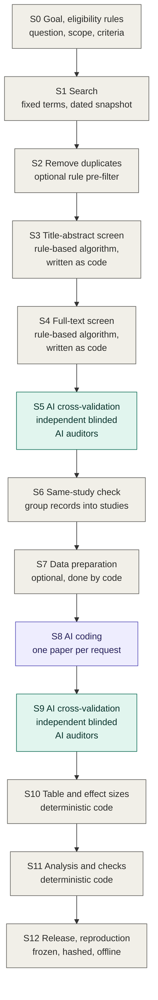

# RAES: Reproducible AI-assisted Evidence Synthesis

[English](README.md) | [简体中文](README.zh-CN.md)

**Status:** version 0.5.0. I have used the method from start to finish in my own meta-analysis. The skill has been tried three times, once through every stage on a topic from another field. The repository is still changing; the [changelog](CHANGELOG.md) says what changed.

## What this is

RAES is the workflow I built for my own meta-analysis, where I used large language models to help screen and code the literature, which was growing faster than I could read it. I wanted the AI to do the heavy lifting, but I did not want to ask readers to simply trust it. So the whole workflow follows one idea:

> I write the rules. The AI executes them. Independent AIs audit the execution. Every number is computed by deterministic code or extracted directly from the literature, and the whole run can be reproduced offline.

It is meant for meta-analyses, systematic reviews and similar evidence syntheses. It is not another auto-screening tool. Tools that rank abstracts or extract fields automate one task. RAES is about how the whole synthesis is run, so that someone else can check it.

All domain knowledge sits in a versioned codebook, so the workflow itself does not depend on the field. I developed it and used it end to end in a social-science project, the meta-analysis in my working paper *Whose Welfare Does AI Maximize? Decision Perspectives in Economic Games: Evidence from a Meta-Analysis and LLM Experiments*. That meta-analysis includes 72 studies of how LLMs behave in classic economic games; 54 of them contribute the 757 effect sizes.

## What you get

- **A skill, `raes`,** for Claude Code, Codex and other hosts that support Agent Skills. It walks you through the workflow stage by stage: it asks for the decisions a stage needs, writes the files from the templates and runs the checks.
- **A working manual** for the whole synthesis, from the research question to the release: [PROTOCOL.md](PROTOCOL.md) ([中文](PROTOCOL.zh-CN.md)).
- **Templates** for every file the method asks you to write, and a starter project that already contains its programs: a deduplication script, a rule-based screening program, and one command that rebuilds every result.
- **A small invented example** that runs the whole pipeline offline, with saved AI answers, an audit that finds a wrongly excluded paper, which the revised rule then includes, and a coding error that the audit corrects.

## How to use this repository

You need Python 3.10 or newer and nothing else. No package has to be installed, and nothing here calls a model or needs a key. For a real review, the AI steps (S5, S8, S9) need your own API access; see "What is not included".

**1. Install the skill.** In Claude Code or Codex, say:

> Install the skill `raes` from https://github.com/shanbuzaigao/raes.

The assistant fetches the repository and puts `skills/raes` into its skills folder. Restart the host, then type `/raes` (Claude Code) or `$raes` (Codex) with a sentence about where you are:

> /raes I have a research question about structured versus plain feedback and no files yet. Start at S0.

The skill asks, drafts, checks and records. It does not decide for you, and it never sends a request to a model provider. To install by hand: clone the repository and run `python tools/install_skill.py --destination ~/.claude/skills`; for Codex use `~/.agents/skills`. After the repository has changed, run the same command with `--replace`. Other hosts are listed in [skills/](skills/README.md).

**2. Look inside.** For that you need the repository:

```sh
git clone https://github.com/shanbuzaigao/raes.git
cd raes
```

Or use "Download ZIP" on the repository page.

*See it run.*

```sh
python examples/synthetic/reproduce.py
```

Everything in the example is invented. It rebuilds all results from saved answers and shows a duplicate record, a paper that was wrongly screened out, found by the audit and included by the revised rule, a missing SD, a failed model answer followed by a retry, and a coding error caught by the audit. [examples/synthetic/](examples/synthetic/README.md) explains what to look for.

*Read the method.* [PROTOCOL.md](PROTOCOL.md) expands every stage of the figure below in the same format: who does it, what goes in and comes out, what I do, and what I check before moving on.

*Start your own project by hand.*

```sh
python tools/new_project.py ../my-evidence-project
python tools/check_codebook.py --eligibility ../my-evidence-project/codebook/eligibility.json
```

The first command creates a project folder outside the repository, with the templates in the order of the pipeline and three programs of its own: `search/dedupe_records.py`, `screening/screen_rules_template.py` and `run_pipeline.py`. The second command checks the first file you fill in, the eligibility criteria. [templates/](templates/README.md) says what each file is for and at which stage you fill it in; a [field-by-field guide in Chinese](templates/GUIDE.zh-CN.md) explains every entry.

## The pipeline at a glance



Grey boxes are done by me or by deterministic code. The purple box is executed by an AI under the codebook. Green boxes are audits by independent AIs. Stages S1 to S6 follow the PRISMA 2020 flow from identification to included studies, and the later stages carry the same discipline through coding, analysis and release.

The goal and the eligibility rules come first, because everything else refers to them. Every step that calls an AI is then prepared in the same order: a plan, the codebook, the prompts, and only then the run.

## What is in this repository

| Where | What it is |
|---|---|
| [PROTOCOL.md](PROTOCOL.md) ([中文](PROTOCOL.zh-CN.md)) | The working manual, stage by stage |
| [templates/](templates/README.md) | Files to fill in: eligibility criteria, deduplication rules, screening rules and program, plan memo, codebook, prompts, the two audit sets, and the starter project with its pipeline runner; a [field-by-field guide in Chinese](templates/GUIDE.zh-CN.md) |
| [skills/](skills/README.md) | `raes`, the skill: instructions, one reference per stage, a copy of the templates, and its scripts (new project, codebook check, template check, dispersion check, release, offline run) |
| [examples/synthetic/](examples/synthetic/README.md) | A small invented example that runs the whole pipeline offline, including the effect-size code it uses and the [notes on its formulas](examples/synthetic/NUMERICAL_METHODS.md) |
| [raes_core/](raes_core) | Small general tools: stable row IDs, hash freezes, JSON reading and writing |
| [tools/](tools) | The commands used above, and `python tools/check_repository.py`, which runs every check and test of this repository |
| [tests/](tests) | The tests; they also run on GitHub after every push, on Linux and Windows with Python 3.10 and 3.13 |

A note on the name: a Python package called `raes` exists on PyPI. It is a different project and has nothing to do with this repository.

## Why I think this is needed

Evidence-synthesis organizations now expect authors who use AI to keep human oversight and to show that AI does not compromise methodological rigor. This is the message of the RAISE recommendations (Thomas et al., 2025) and of the 2025 joint position statement by Cochrane, the Campbell Collaboration, JBI and the Collaboration for Environmental Evidence (Flemyng et al., 2025). These documents say what is expected. RAES is my attempt at one concrete, executable way of meeting it.

## What it builds on

The first half of the pipeline follows PRISMA 2020 (Page et al., 2021). The two screening stages are rule-based, as in Robleto and Shehadeh (2025), who screen with transparent Python rules, first on titles and abstracts and then on full texts. They validate the rules by reading samples of excluded records by hand, and they name a more rigorous, quantitative validation as the next step. RAES takes that step: frozen rules, a sample specified in advance, blinded AI auditors from different vendors, and a fixed stopping rule. It then carries the same discipline past screening, into the same-study check, AI coding under a codebook, cross-validation of the coded rows, effect sizes computed only by code, and releases that can be rebuilt offline.

## Three layers

| Layer | Question it answers | Form in this repository |
|---|---|---|
| Pipeline | What happens at each stage, in what order, producing which files | Protocol, project template, synthetic example |
| Authoring | How to write the plan, the codebook, the prompts and the validation design | Templates, the skill |
| Validation and provenance | Why others can trust the result | The audit steps of the example, freeze and hash tools, release conventions |

## Principles

These are the rules I ended up following. Each one came from a problem I actually ran into.

1. **Codebook first.** I write every substantive judgment into a versioned codebook before any formal run. Prompts are generated from the codebook, not the other way round.
2. **The AI executes rules; it does not set scope.** The model may not rewrite, relax or replace criteria. Missing evidence becomes `null` plus an unresolved item, never an invented value.
3. **The unit of judgment is the condition, not the paper.** Eligibility and coding are decided per experimental condition, role and outcome.
4. **Deterministic wherever possible.** Screening rules are code when feasible. Effect sizes, standard errors and intervals are computed by deterministic code; the model only selects the computation path.
5. **Independent audit.** Auditors come from different vendors. A screening auditor never sees the earlier decision. A coding auditor sees the coded values it has to check, but not the reasoning behind them. A further auditor is called only on disagreement or challenge. Human adjudication is limited and requires page-linked evidence.
6. **A technical failure is not a decision.** Refusals, malformed output and timeouts are retried under an unchanged request identity and never become an exclusion or a pass.
7. **Sampling and stopping rules are fixed in advance.** Strata, seeds and clean-round stopping conditions are written before validation starts.
8. **Everything that enters a formal run is frozen and hashed.** A change that could affect decisions means a new version. Affected items are validated again, and unaffected results are kept only after an exact check.
9. **Releases are immutable; pointers move.** Dated releases stay as they are, a `CURRENT` pointer names the active one, and history is never silently rewritten.
10. **Offline reproducibility.** One command rebuilds all results from the saved responses, without calling any API.
11. **Cached attributes keep entities consistent across studies.** The same entity receives the same coded attributes wherever it appears, and the cache is versioned like a rule file.
12. **Say what each validation shows and what it does not.**

## What is not included

- Programs that send requests to model providers for the AI steps (S5, S8, S9). The templates and the skill prepare those steps up to the point where everything is frozen and ready; each project sends the requests with its own runner. A general runner may come later.
- Copyrighted paper PDFs, author-provided data, the research data from my own study, raw model responses that quote sources at length, and any credentials.

## Use of AI tools

I used AI coding and writing assistants while preparing the code and documentation in this repository. The workflow design, the rules, and all methodological decisions are my own, and I review everything before it is released. Any remaining errors are mine.

## How to cite

If you use RAES, its templates or its skill, please cite this repository. If you build on the method, please also cite the working paper it comes from. GitHub's "Cite this repository" button gives the same reference in other formats; it reads [CITATION.cff](CITATION.cff).

> Zhu, Q. (2026). *RAES: Reproducible AI-assisted Evidence Synthesis* (Version 0.5.0) [Computer software]. https://github.com/shanbuzaigao/raes

```bibtex
@software{zhu_raes_2026,
  author  = {Zhu, Qijun},
  title   = {{RAES}: Reproducible {AI}-assisted Evidence Synthesis},
  year    = {2026},
  version = {0.5.0},
  url     = {https://github.com/shanbuzaigao/raes}
}
```

Replace the version with the one you used. The working paper: Zhu, Q. (2026). *Whose Welfare Does AI Maximize? Decision Perspectives in Economic Games: Evidence from a Meta-Analysis and LLM Experiments*. Working paper, George Mason University.

## License

Source code, including the Python programs under `templates/` and in the skill, is released under the [MIT License](LICENSE). The documentation, the protocol and the prose and JSON templates are released under [CC BY 4.0](LICENSE-docs.md), which allows reuse and adaptation with attribution.

## References

- Flemyng, E., Noel-Storr, A., Macura, B., et al. (2025). Position statement on artificial intelligence (AI) use in evidence synthesis across Cochrane, the Campbell Collaboration, JBI and the Collaboration for Environmental Evidence 2025. *Environmental Evidence*. https://doi.org/10.1186/s13750-025-00374-5
- Page, M. J., McKenzie, J. E., Bossuyt, P. M., et al. (2021). The PRISMA 2020 statement: An updated guideline for reporting systematic reviews. *BMJ*, 372, n71. https://doi.org/10.1136/bmj.n71
- Robleto, E., & Shehadeh, L. A. (2025). Accelerating systematic reviews: A novel 1-wk screening protocol using rule-based automation with AI-assisted Python coding. *American Journal of Physiology-Heart and Circulatory Physiology*, 329(5), H1391–H1413. https://doi.org/10.1152/ajpheart.00374.2025
- Thomas, J., Flemyng, E., Noel-Storr, A., et al. (2025). *Responsible use of AI in evidence SynthEsis (RAISE): Recommendations and guidance*. Open Science Framework. https://doi.org/10.17605/OSF.IO/FWAUD

## Contact

Questions and suggestions: zqj0966522453@gmail.com. I maintain the method myself and do not take pull requests.

Qijun Zhu, Ph.D. candidate in Economics, George Mason University
