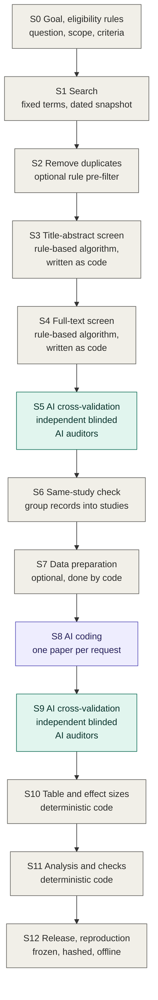

# RAES: Reproducible AI-assisted Evidence Synthesis

[English](README.md) | [简体中文](README.zh-CN.md)

**Status:** early development, v0.3.0-rc.1. I am keeping this repository private until I have reviewed the first release.

## What this is

RAES is the workflow I built for my own meta-analysis, where I used large language models to help screen and code a literature that was growing faster than I could read it. I wanted the AI to do the heavy lifting, but I did not want to ask readers to simply trust it. So the whole workflow follows one idea:

> I write the rules. The AI executes them. Independent AIs audit the execution. Every number is computed by deterministic code or extracted directly from the literature, and the whole run can be reproduced offline.

It is meant for meta-analyses, systematic reviews and similar evidence syntheses. It is not another auto-screening tool. Tools that rank abstracts or extract fields automate one task. RAES is about how the whole synthesis is run, so that someone else can check it.

All domain knowledge sits in a versioned codebook, so the workflow itself does not depend on the field. I developed it and used it end to end in a social-science project, the meta-analysis in my working paper *Whose Welfare Does AI Maximize? Decision Perspectives in Economic Games: Evidence from a Meta-Analysis and LLM Experiments*. That meta-analysis covers 54 papers and 757 effect sizes on how LLMs behave in classic economic games.

## The pipeline at a glance



Grey boxes are done by me or by deterministic code. The purple box is executed by an AI under the codebook. Green boxes are audits by independent AIs. Stages S1 to S6 follow the PRISMA 2020 flow from identification to included studies, and the later stages carry the same discipline through coding, analysis and release.

The goal and the eligibility rules come first, because everything else refers to them. Every step that calls an AI is then prepared in the same order: a plan, the codebook, the prompts, and only then the run.

The working manual is [PROTOCOL.md](PROTOCOL.md). It expands every stage of the figure in the same format. It is a draft.

## What is in this repository

| Where | What it is |
|---|---|
| [PROTOCOL.md](PROTOCOL.md) | The working manual, stage by stage |
| [templates/](templates/README.md) | Files to fill in: plan memo, eligibility criteria, codebook, prompts, validation memo and settings, project folders |
| [skills/](skills/README.md) | `codebook-author`, a skill that asks you questions and helps you write a codebook |
| [examples/synthetic/](examples/synthetic/README.md) | A small invented example that runs the whole pipeline offline |
| [raes_core/](docs/NUMERICAL_METHODS.md) | The small tools the example uses: effect sizes, stable row IDs, hash freezes |
| [tests/](tests) and [tools/](tools) | Tests and helper commands |

To try the example you only need Python 3.10 or newer:

```sh
python examples/synthetic/reproduce.py
```

Everything in the example is invented. It makes no API calls and needs no key. It shows a duplicate record, a paper that was wrongly screened out and then rescued by the audit, a missing SD, a failed model answer followed by a retry, and a coding error caught by the audit. To run all checks, use `python tools/check_repository.py`.

A note on the name: a Python package called `raes` exists on PyPI. It is a different project and has nothing to do with this repository.

## Why I think this is needed

Evidence-synthesis organizations now expect authors who use AI to keep human oversight and to show that AI does not compromise methodological rigor. This is the message of the RAISE recommendations (Thomas et al., 2025) and of the 2025 joint position statement by Cochrane, the Campbell Collaboration, JBI and the Collaboration for Environmental Evidence (Flemyng et al., 2025). These documents say what is expected. They do not say how to do it in practice. RAES is my attempt at one concrete, executable answer.

## What it builds on

The first half of the pipeline follows PRISMA 2020 (Page et al., 2021). The two screening stages are rule-based, as in Robleto and Shehadeh (2025), who screen with transparent Python rules, first on titles and abstracts and then on full texts. They validate the rules by reading samples of excluded records by hand, and they name a more rigorous, quantitative validation as the next step. RAES takes that step: frozen rules, a sample specified in advance, blinded AI auditors from different vendors, and a fixed stopping rule. It then carries the same discipline past screening, into the same-study check, AI coding under a codebook, cross-validation of the coded rows, effect sizes computed only by code, and releases that can be rebuilt offline.

## Three layers

| Layer | Question it answers | Form in this repository |
|---|---|---|
| Pipeline | What happens at each stage, in what order, producing which files | Protocol, project template, synthetic example |
| Authoring | How to write the plan, the codebook, the prompts and the validation design | Templates, agent skills |
| Validation and provenance | Why others can trust the result | The audit steps of the example, freeze and hash tools, release conventions |

## Principles

These are the rules I ended up following. Each one came from a problem I actually ran into.

1. **Codebook first.** I write every substantive judgment into a versioned codebook before any formal run. Prompts are generated from the codebook, not the other way round.
2. **The AI executes rules; it does not set scope.** The model may not rewrite, relax or replace criteria. Missing evidence becomes `null` plus an unresolved item, never an invented value.
3. **The unit of judgment is the condition, not the paper.** Eligibility and coding are decided per experimental condition, role and outcome.
4. **Deterministic wherever possible.** Screening rules are code when feasible. Effect sizes, standard errors and intervals are computed by deterministic code; the model only selects the computation path.
5. **Independent audit.** Auditors come from different vendors. A screening auditor never sees the earlier decision. A coding auditor sees the coded values it has to check, but not the reasoning behind them. A further auditor is called only on disagreement or challenge. Human adjudication is limited and requires page-linked evidence.
6. **A technical failure is not a decision.** Refusals, malformed output and timeouts are retried under an unchanged request identity and never become an exclusion or a pass.
7. **Sampling and stopping rules are fixed in advance.** Strata, seeds and clean-round stopping conditions are written before validation starts.
8. **Everything that enters a formal run is frozen and hashed.** A change that could affect decisions means a new version. Affected items are validated again, and unaffected results are kept only after an exact check.
9. **Releases are immutable; pointers move.** Dated releases stay as they are, a `CURRENT` pointer names the active one, and history is never silently rewritten.
10. **Offline reproducibility.** One command rebuilds all results from the saved responses, without calling any API.
11. **Cached attributes keep entities consistent across studies.** The same entity receives the same coded attributes wherever it appears.
12. **Say what each validation shows and what it does not.**

## What I plan to add

- A Chinese version of the protocol.
- A second skill, for designing the validation, once the first one has been tried on a real project.
- Runners that call the model providers for the AI steps. They are not included yet.

## What will not be in this repository

Copyrighted paper PDFs, author-provided data, the research data from my own study, raw model responses that quote sources at length, and any credentials.

## Use of AI tools

I used AI coding and writing assistants while preparing the code and documentation in this repository. The workflow design, the rules, and all methodological decisions are my own, and I review everything before it is released. Any remaining errors are mine.

## References

- Flemyng, E., Noel-Storr, A., Macura, B., et al. (2025). Position statement on artificial intelligence (AI) use in evidence synthesis across Cochrane, the Campbell Collaboration, JBI and the Collaboration for Environmental Evidence 2025. *Environmental Evidence*. https://doi.org/10.1186/s13750-025-00374-5
- Page, M. J., McKenzie, J. E., Bossuyt, P. M., et al. (2021). The PRISMA 2020 statement: An updated guideline for reporting systematic reviews. *BMJ*, 372, n71. https://doi.org/10.1136/bmj.n71
- Robleto, E., & Shehadeh, L. A. (2025). Accelerating systematic reviews: A novel 1-wk screening protocol using rule-based automation with AI-assisted Python coding. *American Journal of Physiology-Heart and Circulatory Physiology*, 329(5), H1391–H1413. https://doi.org/10.1152/ajpheart.00374.2025
- Thomas, J., Flemyng, E., Noel-Storr, A., et al. (2025). *Responsible use of AI in evidence SynthEsis (RAISE): Recommendations and guidance*. Open Science Framework. https://doi.org/10.17605/OSF.IO/FWAUD

## License

Code is released under the [MIT License](LICENSE). Documentation and templates are released under [CC BY 4.0](LICENSE-docs.md).

## Citation

If you use RAES, please cite it; see [CITATION.cff](CITATION.cff). The workflow comes out of my working paper, *Whose Welfare Does AI Maximize? Decision Perspectives in Economic Games: Evidence from a Meta-Analysis and LLM Experiments*.

Qijun Zhu, Ph.D. candidate in Economics, George Mason University
