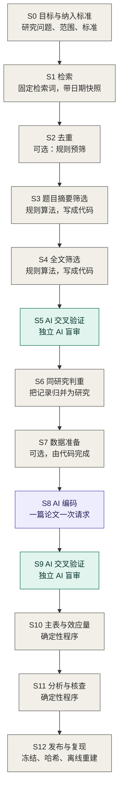

# RAES：可复现的 AI 辅助证据整合

[English](README.md) | [简体中文](README.zh-CN.md)

[](https://github.com/shanbuzaigao/raes/actions/workflows/check.yml)

本文件是英文版 `README.md` 的翻译。两者不一致时以英文为准。

**状态：** 0.5.1 版。我已经将这套方法完整用于自己的元分析。这个 skill 已经试用了三次，其中一次在另一个领域的项目中完整走完了所有阶段。本仓库仍在修改；改了什么见[更新日志](CHANGELOG.md)。

## 这是什么

RAES 是我为自己的元分析搭建的工作流。当时文献增长的速度超过了我的阅读速度，我就借助大语言模型来辅助文献的筛选和编码。我希望由 AI 来承担繁重的工作，但不想让读者只能选择相信它。于是，整个工作流都围绕一个想法：

> 我制定规则，AI 执行规则。独立的 AI 对执行过程进行审计。每一个数字都由确定性程序计算，或者直接取自文献；整个运行过程支持离线复现。

这套方法适用于元分析、系统综述和类似的证据整合工作。它并非只是一个用于摘要排序、提取字段的自动筛选工具；RAES 关注的是整个证据整合过程应当如何运行，使其他人能够核查。

所有领域知识都存放在带版本号的 codebook 中，因此工作流本身并不依赖具体的研究领域。我在一个社会科学项目中开发并完整使用了这套方法，那就是我的工作论文 *Whose Welfare Does AI Maximize? Decision Perspectives in Economic Games: Evidence from a Meta-Analysis and LLM Experiments* 中的元分析。这项元分析研究大语言模型在经典经济博弈中的行为，共纳入 72 项研究，其中 54 项贡献了 757 个效应量。

## 你能得到什么

- **一个 skill，`raes`**，用于 Claude Code、Codex 和其他支持 Agent Skills 的宿主。它带你逐个阶段跑通工作流：询问当前阶段需要的决定、根据模板生成文件，并运行各项检查。
- **一份操作手册**，覆盖整个证据整合过程，从研究问题到发布：[PROTOCOL.zh-CN.md](PROTOCOL.zh-CN.md)（英文版 [PROTOCOL.md](PROTOCOL.md)）。
- **一套模板**，方法要求你写的每一份文件都有对应的模板；还有一个起步项目，已经自带三个程序：去重脚本、规则化筛选程序，以及一条重新生成全部结果的命令。
- **一个虚构的小型示例**，在离线状态下运行整条流程。它包含保存好的 AI 回答；一次审计发现了一篇被误排除的论文，随后修订的规则把它纳入；还有一处编码错误，由审计更正。

## 谁适合使用 RAES

如果你想使用 AI 来辅助文献综述，RAES 可以提供一套结构化的工作流程。它既适用于元分析和系统综述，也适用于其他需要从一批文献中筛选研究、提取信息、比较研究结果或整理证据的项目。

如果你的项目需要处理大量文献、从论文中提取结构化信息，同时又希望能够说明 AI 在哪些环节参与、依据什么规则作出判断、这些判断经过了怎样的检查，并让整个过程尽可能可核查、可复现，RAES 尤其适合这类工作。

你也不必一次采用整套流程。可以根据项目需要，先使用其中的模板、codebook、审计设计或复现工具，再逐步扩展。

## 如何使用本仓库

你只需要 Python 3.10 或更高版本，不需要其他任何东西。无需安装任何包，这里的代码也不调用任何模型、不需要任何密钥。真正做一项综述时，调用 AI 的步骤（S5、S8、S9）需要自己设置 API；详见“未包含的内容”。

**1. 装 skill。** 在 Claude Code 或 Codex 里说一句：

> 把 https://github.com/shanbuzaigao/raes 里的 skill `raes` 装上。

助手会获取仓库，把 `skills/raes` 放进它的 skill 文件夹。重启宿主，然后输入 `/raes`（Claude Code）或 `$raes`（Codex），再用一句话说明你现在到了哪一步：

> /raes 我有一个关于结构化反馈和普通反馈的研究问题，还没有任何文件。从 S0 开始。

这个 skill 负责提问、起草、检查和记录。它不会替你做决定，也绝不会向模型厂商发送请求。想自己动手装：clone 仓库，运行 `python tools/install_skill.py --destination ~/.claude/skills`，Codex 用 `~/.agents/skills`。仓库更新之后，同一条命令加上 `--replace`。其他宿主见 [skills/](skills/README.zh-CN.md)。

**2. 想了解方法本身，先下载仓库。**

```sh
git clone https://github.com/shanbuzaigao/raes.git
cd raes
```

也可以在仓库页面点击“Download ZIP”。

**查看运行效果。**

```sh
python examples/synthetic/reproduce.py
```

示例中的所有内容都是虚构的。它会根据保存的回答重新生成全部结果，并演示以下情况：一条重复的记录、一篇被误排除的论文（审计发现后，由修订的规则纳入）、一处缺失的 SD、一次模型回答失败后的重试，以及一处由审计发现的编码错误。[examples/synthetic/](examples/synthetic/README.zh-CN.md) 说明了重点看什么。

**阅读方法。** [PROTOCOL.zh-CN.md](PROTOCOL.zh-CN.md) 以相同的格式展开下图中的每一个阶段：由谁来做、输入和输出是什么、我怎么做，以及进入下一阶段前检查什么。

**自己动手建项目。**

```sh
python tools/new_project.py ../my-evidence-project
python tools/check_codebook.py --eligibility ../my-evidence-project/codebook/eligibility.json
```

第一条命令会在本仓库目录之外创建一个项目文件夹，其中会按流程顺序放入各项模板，并自带三个程序：`search/dedupe_records.py`、`screening/screen_rules_template.py` 和 `run_pipeline.py`。第二条命令检查你填写的第一份文件，即纳入标准文件。[templates/](templates/README.zh-CN.md) 说明了每份文件的作用以及应该在哪一个阶段填写；[逐字段中文指南](templates/GUIDE.zh-CN.md) 逐条说明每一项怎么填。

## 流程总览



灰色方框由我或确定性程序完成。紫色方框由 AI 在 codebook 的约束下执行。绿色方框是独立 AI 做的审计。阶段 S1 到 S6 沿用 PRISMA 2020 的流程，从识别到最终纳入研究；后面的阶段把同样的要求延伸到编码、分析和发布。

研究目标和纳入标准最先确定，因为后面每一步都要引用它们。此后，每一个调用 AI 的步骤都按相同的顺序准备：先制定计划，再撰写 codebook，然后设计 prompt，最后才正式运行。

## 仓库里有什么

| 位置 | 内容说明 |
|---|---|
| [PROTOCOL.zh-CN.md](PROTOCOL.zh-CN.md) | 逐阶段的操作手册 |
| [templates/](templates/README.zh-CN.md) | 需要填写的文件：纳入标准、去重规则、筛选规则与程序、计划 memo、codebook、prompt、两套审计文件，以及带有流程运行程序的起步项目；附[逐字段中文指南](templates/GUIDE.zh-CN.md) |
| [skills/](skills/README.zh-CN.md) | `raes` skill：使用说明、每个阶段一份参考文档、模板副本，以及配套脚本（新建项目、codebook 检查、模板检查、离散度检查、发布、离线运行） |
| [examples/synthetic/](examples/synthetic/README.zh-CN.md) | 一个虚构的小型示例，离线运行整条流程，包含所用的效应量计算代码及[公式说明](examples/synthetic/NUMERICAL_METHODS.md) |
| [raes_core/](raes_core) | 小型通用工具：稳定的行编号、哈希冻结、JSON 读写 |
| [tools/](tools) | 上文用到的命令，以及 `python tools/check_repository.py`，它运行本仓库的全部检查和测试 |
| [tests/](tests) | 测试用例；每次推送后也会在 GitHub 上运行，覆盖 Linux 和 Windows 平台以及 Python 3.10 和 3.13 |

关于名称的一点说明：PyPI 上存在一个名为 `raes` 的 Python 包。那是另一个项目，与本仓库无关。

## 为什么我认为需要这套方法

证据整合领域的主要机构如今要求使用 AI 的作者保持人工监督，并能说明 AI 的使用不会损害方法的严谨性。这也是 RAISE 建议（Thomas et al., 2025）以及 Cochrane、Campbell Collaboration、JBI 和环境证据协作组织（Collaboration for Environmental Evidence）在 2025 年联合发表的立场声明（Flemyng et al., 2025）中的重点。这些文件明确说明了相关要求。RAES 则是我的一次尝试：给出一种具体、可执行的做法来满足这些要求。

## 本方法的基础

本流程的前半部分遵循 PRISMA 2020（Page et al., 2021）。两个筛选阶段都是规则化的，和 Robleto and Shehadeh（2025）的做法一样：他们用透明的 Python 规则先筛题目和摘要，再筛全文。他们靠人工抽读被排除的记录来验证规则，并把更严格的量化验证列为下一步。RAES 迈出了这一步：冻结规则、事先定好的样本、来自不同厂商且看不到先前判断的 AI 审计模型，以及固定的停止规则。接着，RAES 把同样的要求延伸到筛选之后的环节：同研究判重、codebook 约束下的 AI 编码、编码行的交叉验证、只由程序计算的效应量，以及可以离线重新生成的发布包。

## 三个层次

| 层次 | 回答的问题 | 在本仓库中的呈现形式 |
|---|---|---|
| 流程层 | 每个阶段做什么、按什么顺序做、产出哪些文件 | 操作手册、项目模板、虚构的示例 |
| 编写层 | 如何撰写计划、codebook、prompt 以及验证方案 | 模板、skill |
| 验证与可追溯层 | 为什么其他人可以信任该结果 | 示例中的审计步骤、冻结与哈希工具、发布约定 |

## 原则

以下是我最终遵循的规则。每一条都源自我实际遇到的具体问题。

1. **先写 codebook。** 在任何正式运行之前，我都会先将所有实质性判断明确记录在带版本号的 codebook 中；prompt 则根据 codebook 生成，而不是反过来由 prompt 决定 codebook。
2. **AI 执行规则，不决定范围。** 模型不得改写、放宽或替换标准。证据缺失时记为 `null`，并写入未解决事项，绝不填入编造的值。
3. **判断的单位是条件，不是论文。** 什么算一个条件由项目的 codebook 定义，在我的项目里是实验组、角色和结果指标的组合。纳入与编码按条件逐一判断，所以一篇论文可以被纳入，而其中大多数条件不纳入。
4. **能用确定性程序的，就用确定性程序。** 筛选规则只要可行就写成代码。效应量、标准误和区间都由确定性程序计算；模型只负责选择计算路径。
5. **独立审计。** 审计模型来自不同的模型厂商。筛选阶段的审计模型永远看不到此前的判断。编码阶段的审计模型看得到需要核对的编码值，但看不到背后的推理过程。只有在出现分歧或质疑时，才会引入进一步的审计模型。人工裁决的范围有限，而且必须附带能对应到页码的证据。
6. **技术失败不是判断。** 拒绝回答、格式错误的输出和超时，都在原请求不变的情况下重试，绝不会变成排除或通过。
7. **抽样和停止规则事先定好。** 分层方式、随机种子和停止条件，都在验证开始前确定。
8. **所有进入正式运行的材料都冻结并记录哈希值。** 任何可能影响判断的修改都意味着新版本。受影响的项要重新验证；未受影响的结果，只有核对确认完全一致后才保留。
9. **发布包不可变，指针可以移动。** 带日期的发布包保持原样，`CURRENT` 这个指针文件指向当前使用的发布包，绝不悄悄改写历史。
10. **离线复现。** 一条命令就能根据保存的回答重新生成所有结果，不调用任何 API。
11. **通过属性缓存保证同一实体在不同研究中的编码一致。** 同一实体无论出现在哪项研究里，编码属性都相同；缓存和规则文件一样带版本号。
12. **说清每项验证说明了什么、没有说明什么。**

## 未包含的内容

- 向模型厂商发送请求的程序，也就是 AI 步骤（S5、S8、S9）里实际发出请求的那一部分。模板和 skill 负责完成这些步骤的准备工作，直至所需内容冻结并就绪；每个项目用自己的运行程序发送请求。未来可能会提供通用的运行程序。
- 受版权保护的论文 PDF、作者提供的数据、我自己研究的数据、包含大段原文引用的原始模型回答，以及任何凭据。

## AI 工具的使用

在编写本仓库的代码和文档时，我使用了 AI 编码和写作助手。工作流的设计、规则以及所有方法上的决定均由我本人作出，发布前我会审核全部内容。我对最终发布的内容负责。

## 如何引用

如果你使用了 RAES、本仓库的模板或 skill，请引用本仓库。如果你基于这套方法开展进一步工作，也请一并引用它所源自的工作论文。GitHub 页面上的“Cite this repository”按钮给出同一条引用的其他格式；它读取的是 [CITATION.cff](CITATION.cff)。

> Zhu, Q. (2026). *RAES: Reproducible AI-assisted Evidence Synthesis* (Version 0.5.1) [Computer software]. https://github.com/shanbuzaigao/raes

```bibtex
@software{zhu_raes_2026,
  author  = {Zhu, Qijun},
  title   = {{RAES}: Reproducible {AI}-assisted Evidence Synthesis},
  year    = {2026},
  version = {0.5.1},
  url     = {https://github.com/shanbuzaigao/raes}
}
```

请将版本号替换为你实际使用的版本。这篇工作论文是：Zhu, Q. (2026). *Whose Welfare Does AI Maximize? Decision Perspectives in Economic Games: Evidence from a Meta-Analysis and LLM Experiments*. Working paper, George Mason University.

## 许可证

源代码（包括 `templates/` 下及 skill 中的 Python 程序）采用 [MIT 许可证](LICENSE) 发布。文档、操作手册以及文本和 JSON 模板采用 [CC BY 4.0](LICENSE-docs.md) 发布，允许在注明出处的前提下重用和改编。

## 参考文献

- Flemyng, E., Noel-Storr, A., Macura, B., et al. (2025). Position statement on artificial intelligence (AI) use in evidence synthesis across Cochrane, the Campbell Collaboration, JBI and the Collaboration for Environmental Evidence 2025. *Environmental Evidence*. https://doi.org/10.1186/s13750-025-00374-5
- Page, M. J., McKenzie, J. E., Bossuyt, P. M., et al. (2021). The PRISMA 2020 statement: An updated guideline for reporting systematic reviews. *BMJ*, 372, n71. https://doi.org/10.1136/bmj.n71
- Robleto, E., & Shehadeh, L. A. (2025). Accelerating systematic reviews: A novel 1-wk screening protocol using rule-based automation with AI-assisted Python coding. *American Journal of Physiology-Heart and Circulatory Physiology*, 329(5), H1391–H1413. https://doi.org/10.1152/ajpheart.00374.2025
- Thomas, J., Flemyng, E., Noel-Storr, A., et al. (2025). *Responsible use of AI in evidence SynthEsis (RAISE): Recommendations and guidance*. Open Science Framework. https://doi.org/10.17605/OSF.IO/FWAUD

## 联系方式

如有疑问和建议，请联系：zqj0966522453@gmail.com。本方法目前由我独立维护，暂不通过 pull request 接收外部修改。

Qijun Zhu，乔治梅森大学经济学博士候选人
