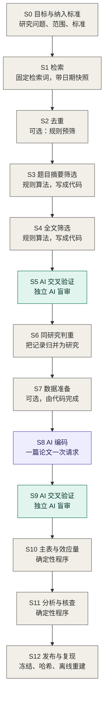

# RAES：可复现的 AI 辅助证据整合

[English](README.md) | [简体中文](README.zh-CN.md)

本文件对应英文版 `README.md` v0.1（2026-09-17）。两者不一致时以英文为准。

**状态：** 早期开发，v0.3.0-rc.1。在我审核完第一个版本之前，这个仓库保持私有。

## 这是什么

RAES 是我为自己的 meta-analysis 搭的一套工作流程。当时文献增长的速度超过了我能读的速度，我用大语言模型来帮忙筛选和编码。我希望 AI 承担繁重的部分，但不想让读者只能"相信它"。所以整套流程围绕一个想法：

> 我来写规则，AI 执行规则，独立的 AI 审计执行结果；每个数值要么由确定性程序计算，要么直接取自文献，整个流程可以离线复现。

它面向 meta-analysis、系统综述和类似的证据整合工作。它不是又一个自动筛文献的工具。给摘要排序、抽取字段的工具自动化的是单个任务；RAES 关心的是整个整合过程怎样运行，让别人能够核查。

所有领域知识都放在带版本号的 codebook 里，所以流程本身不依赖具体领域。我是在一个社会科学项目里把它做出来并完整用过一遍的，也就是我的 working paper *Whose Welfare Does AI Maximize? Decision Perspectives in Economic Games: Evidence from a Meta-Analysis and LLM Experiments* 里的 meta-analysis。这项 meta-analysis 研究大语言模型在经典经济博弈中的行为，覆盖 54 篇论文、757 个效应量。

## 流程总览



灰色的格子由我本人或确定性程序完成。紫色的格子由 AI 在 codebook 约束下执行。绿色的格子是独立 AI 的审计。S1 到 S6 沿用 PRISMA 2020 的流程，从检索识别到最终纳入；后面的阶段把同样的要求延伸到编码、分析和发布。

研究目标和纳入标准最先确定，因为后面每一步都要引用它们。每个调用 AI 的环节都按同一个顺序准备：先写计划，再写 codebook，再写 prompt，最后才运行。

完整的操作说明见 [PROTOCOL.md](PROTOCOL.md)，它按同一个格式把图里的每个阶段展开。目前是英文草稿，中文版稍后补上。

## 仓库里有什么

| 位置 | 内容 |
|---|---|
| [PROTOCOL.md](PROTOCOL.md) | 操作手册，逐阶段展开 |
| [templates/](templates/README.zh-CN.md) | 要填写的文件：计划 memo、纳入标准、codebook、prompt、验证 memo 与配置、项目目录 |
| [skills/](skills/README.zh-CN.md) | `codebook-author`：通过提问帮你一步步写出 codebook 的 skill |
| [examples/synthetic/](examples/synthetic/README.zh-CN.md) | 一个编造的小例子，离线把整个流程跑一遍 |
| [raes_core/](docs/NUMERICAL_METHODS.md) | 例子用到的小工具：效应量、稳定行编号、哈希冻结 |
| [tests/](tests) 和 [tools/](tools) | 测试和辅助命令 |

运行例子只需要 Python 3.10 或更新版本：

```sh
python examples/synthetic/reproduce.py
```

例子里的一切都是编造的，不调用任何 API，也不需要密钥。它演示了一条重复记录、一篇被误筛后由审计救回的论文、一处缺失的 SD、一次模型回答失败后的重试，以及一处被审计发现的编码错误。运行全部检查用 `python tools/check_repository.py`。

关于名字：PyPI 上有一个叫 `raes` 的 Python 包，那是另一个项目，与本仓库无关。

## 我为什么觉得需要它

证据整合领域的主要机构已经要求：使用 AI 的作者必须保持人工监督，并且能说明 AI 的使用不损害方法的严谨性。RAISE 建议（Thomas et al., 2025），以及 Cochrane、Campbell Collaboration、JBI 和环境证据协作组织 2025 年的联合立场声明（Flemyng et al., 2025），讲的都是这一点。这些文件说明了要求是什么，但没有说实际怎么做。RAES 是我给出的一种具体的、可执行的做法。

## 它建立在什么之上

流程的前半段沿用 PRISMA 2020（Page et al., 2021）。两个筛选阶段用的是规则化筛选，和 Robleto 与 Shehadeh（2025）一样：他们用透明的 Python 规则筛选，先筛题目摘要，再筛全文。他们靠人工抽读被排除的记录来验证规则，并且把更严格的定量验证列为下一步。RAES 做的就是这一步：规则冻结，样本事先定好，由不同厂商的 AI 盲审，停止规则事先写定。之后 RAES 把同样的要求延伸到筛选之后：同研究判重、codebook 约束下的 AI 编码、对编码结果的交叉验证、只由程序计算的效应量，以及可以离线重建的发布。

## 三层结构

| 层 | 回答的问题 | 在仓库里的形式 |
|---|---|---|
| 流程 | 每个阶段做什么、按什么顺序、产出哪些文件 | Protocol、项目模板、合成例子 |
| 写作 | 计划、codebook、prompt 和验证方案怎么写 | 模板、agent skills |
| 验证与可追溯 | 别人凭什么相信结果 | 例子里的审计步骤、冻结与哈希工具、发布约定 |

## 原则

这些是我最后一直遵守的规则，每一条都来自我实际碰到过的问题。

1. **Codebook 先行。** 每一个实质判断，我都在正式运行前写进带版本号的 codebook。prompt 从 codebook 生成，不是反过来。
2. **AI 执行规则，不设定范围。** 模型不得改写、放宽或替换标准。证据不足时填 `null` 并记录为未解决项，绝不补造。
3. **判断单位是条件，不是论文。** 纳入与编码逐个实验条件、角色和结果指标判断。
4. **能确定性的就确定性。** 筛选规则尽量写成程序。效应量、标准误和区间由确定性代码计算，模型只选择计算路径。
5. **独立审计。** 审计者来自不同厂商。筛选审计看不到先前的判断；编码审计能看到它要核对的编码值，但看不到编码理由。只有出现分歧或质疑时才引入下一位审计者。人工裁决范围受限，且必须有页码证据。
6. **技术失败不是判断。** 拒答、格式错误和超时在不变的请求身份下重试，永远不转成"排除"或"通过"。
7. **抽样和停止规则事先写定。** 分层、随机种子和干净轮次的停止条件在验证开始前确定。
8. **进入正式运行的一切都冻结并留哈希。** 可能影响判断的改动就是新版本；受影响的部分重新验证，未受影响的结果经逐项核对后才能沿用。
9. **发布不可变，指针可移动。** 带日期的发布包保持原样，`CURRENT` 指针指向当前版本，历史不被悄悄改写。
10. **离线可复现。** 一条命令用保存的回答重建全部结果，不调用任何 API。
11. **用缓存保证同一实体跨研究一致。** 同一实体无论出现在哪篇研究里，编码属性都相同。
12. **如实说明每项验证证明了什么、没证明什么。**

## 我计划加入的内容

- Protocol 的中文版。
- 第二个 skill，用来设计验证方案；等第一个在真实项目里试用过再做。
- 调用各家模型的运行器，用于需要 AI 的环节。目前还没有包含。

## 不会进入本仓库的内容

有版权的论文 PDF、作者提供的数据、我自己研究的数据、大段引用原文的模型原始回答，以及任何凭据。

## 关于 AI 工具的使用

本仓库的代码和文档在准备过程中使用了 AI 编程与写作助手。流程设计、规则以及所有方法上的决定都出自我本人，每个版本发布前我都会审核全部内容。如有错误，责任在我。

## 参考文献

- Flemyng, E., Noel-Storr, A., Macura, B., et al. (2025). Position statement on artificial intelligence (AI) use in evidence synthesis across Cochrane, the Campbell Collaboration, JBI and the Collaboration for Environmental Evidence 2025. *Environmental Evidence*. https://doi.org/10.1186/s13750-025-00374-5
- Page, M. J., McKenzie, J. E., Bossuyt, P. M., et al. (2021). The PRISMA 2020 statement: An updated guideline for reporting systematic reviews. *BMJ*, 372, n71. https://doi.org/10.1136/bmj.n71
- Robleto, E., & Shehadeh, L. A. (2025). Accelerating systematic reviews: A novel 1-wk screening protocol using rule-based automation with AI-assisted Python coding. *American Journal of Physiology-Heart and Circulatory Physiology*, 329(5), H1391–H1413. https://doi.org/10.1152/ajpheart.00374.2025
- Thomas, J., Flemyng, E., Noel-Storr, A., et al. (2025). *Responsible use of AI in evidence SynthEsis (RAISE): Recommendations and guidance*. Open Science Framework. https://doi.org/10.17605/OSF.IO/FWAUD

## 许可证

代码采用 [MIT 许可证](LICENSE)。文档和模板采用 [CC BY 4.0](LICENSE-docs.md)。

## 引用

如果你使用了 RAES，请引用它，见 [CITATION.cff](CITATION.cff)。这套流程出自我的 working paper：*Whose Welfare Does AI Maximize? Decision Perspectives in Economic Games: Evidence from a Meta-Analysis and LLM Experiments*。

Qijun Zhu，乔治梅森大学经济学博士候选人
